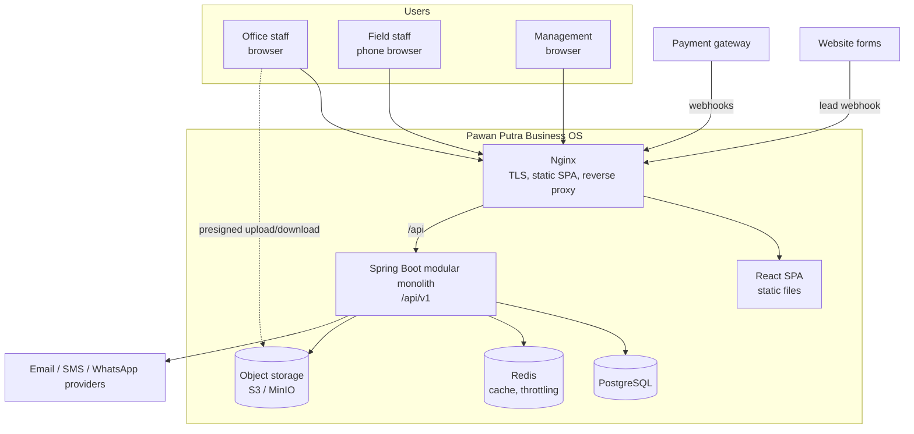

# 01. System Architecture

## Context

The company sells and delivers services across seven verticals. The same staff, customers and money flow across verticals: a customer who installed CCTV may later buy solar, an IT support contract may lead to an interior fit-out. Today that knowledge is spread across people, spreadsheets and chat. The system must make the whole lifecycle visible in one place, for sales, operations, field teams, finance and management.

### Users

| Actor | Main needs |
|-------|-----------|
| Sales executive | Capture leads, qualify, quote, follow up. Mostly desktop, sometimes phone. |
| Sales / vertical manager | Approve discounts and quotations, watch pipeline per vertical. |
| Project manager | Plan projects, assign people and materials, track milestones. |
| Field technician / engineer | See today's jobs, update status, upload site photos, capture customer sign-off. Phone-first. |
| Accounts / finance | Raise invoices, record payments, follow up receivables, GST reporting. |
| Service desk | Log and route service tickets, schedule AMC visits. |
| HR / admin | Employees, roles, attendance, vendors. |
| Owner / management | Cross-vertical dashboards, approvals above thresholds. |
| Customer (later) | View quotations, invoices and tickets. Out of scope for v1 but not blocked by the design. |

### External systems (integration points, none mandatory for v1)

Email (SMTP), SMS / WhatsApp provider, payment gateway webhooks, accounting export (e.g. Tally format), website lead forms. Each is reached through an adapter inside the owning module so that a provider can be replaced without touching business logic.

## Context diagram

## Container view

| Container | Technology | Responsibility | Why it exists |
|-----------|-----------|----------------|---------------|
| Web client | React + TypeScript + Vite, built to static files | All user interfaces | One codebase for desktop and phone (responsive). |
| Reverse proxy | Nginx | TLS termination, serve SPA, proxy `/api`, security headers, request size and rate limits | Keeps the Java app off the public edge; serves static files far more efficiently than Spring. |
| Application | Java 21 + Spring Boot, single deployable | All business logic, REST API, scheduled jobs, internal events | Modular monolith (see below). |
| Database | PostgreSQL | System of record for all business data, audit log, outbox, idempotency keys | Relational integrity for money and lifecycle data. |
| Cache | Redis | Read-through cache for reference data and permissions, login throttling, short-lived tokens | Takes repeated read load off Postgres; never the system of record. |
| Object storage | S3-compatible (MinIO when self-hosted) | Files: photos, drawings, signed documents, generated PDFs | Keeps large binaries out of the database. |

## Key decisions

### D-01.1 Modular monolith, not microservices

**Decision.** Build one Spring Boot application split into domain modules with enforced boundaries. Deploy it as one unit.

**Why.**
- The lifecycle is deeply connected: an order creates a project, a delivery triggers an invoice, a payment unlocks warranty. In one process these are local calls inside one database transaction, which is simpler and safer than distributed transactions or sagas.
- The team is small. Microservices multiply deployment pipelines, monitoring, network failure modes and data-consistency work, which buys nothing at this scale.
- Domain boundaries still matter for maintainability. We get them from module rules (see [02](02-module-boundaries.md)), not from network hops.
- If one module later needs independent scaling (for example analytics or notifications), its public interface and events already form a seam to extract along.

**Rejected.**
- *Microservices from day one:* high operational cost, eventual consistency everywhere, premature.
- *Unstructured monolith (layer-first packages: all controllers together, all repositories together):* fast to start, but every module ends up reading every other module's tables, and the codebase becomes impossible to change safely as it grows to 15+ domains.

### D-01.2 Single company, verticals as a business dimension

**Decision.** The system serves one legal company (with optional branches). Each vertical is a row in a `vertical` table, and most business records carry a `vertical_id`. There is no multi-tenant isolation layer.

**Why.** The requirement is one company's operating system. Customers, staff and money are shared across verticals by design (cross-sell depends on it). A vertical is a reporting, permission and configuration dimension, not a tenant.

**Rejected.** *Multi-tenant SaaS design (tenant_id on every table, tenant-aware security):* adds complexity to every query and test for a need nobody has stated. If it ever becomes a product for other companies, that is a separate decision.

### D-01.3 Single-page application served by Nginx

**Decision.** The frontend is a client-rendered React SPA built by Vite and served as static files by Nginx from the same origin as the API.

**Why.** It is an authenticated internal tool: no SEO need, so server-side rendering adds nothing. Same origin removes CORS configuration and lets us use secure, `SameSite=Strict` cookies for the refresh token (see [07](07-security-architecture.md)).

**Rejected.** *Server-side rendering frameworks:* not in the stack, no benefit for a logged-in app. *Separate native mobile app:* field staff use a responsive web UI first; a native or offline app is a later decision when field usage proves the need.

### D-01.4 Synchronous REST between browser and server

**Decision.** The browser talks to the server only through REST/JSON under `/api/v1`. No WebSockets in v1.

**Why.** Every screen in the lifecycle is request/response. TanStack Query refetch-on-focus and polling cover "fresh enough" dashboards and notification counts.

**Rejected.** *WebSockets / server-sent events:* adds connection management behind Nginx and in the app for a benefit (live push) that no v1 workflow needs. Revisit if live dispatch boards become a requirement.

## Quality attributes and how the architecture addresses them

| Attribute | Target (v1) | Addressed by |
|-----------|-------------|-------------|
| Correctness of money | No lost or duplicated payments; invoice totals always reconcile | Transactions, `NUMERIC` money, idempotency keys, outbox ([05](05-database-architecture.md), [06](06-api-architecture.md), [08](08-event-architecture.md)) |
| Auditability | Who did what, when, before/after, for every important operation | Audit module written inside the same transaction ([07](07-security-architecture.md)) |
| Security | Least privilege per role, vertical and record ownership | RBAC + data scopes enforced server-side ([07](07-security-architecture.md)) |
| Maintainability | A change in one module rarely touches another | Module boundaries, public interfaces, events ([02](02-module-boundaries.md)) |
| Performance | p95 < 500 ms for list and detail APIs at expected load (tens to low hundreds of concurrent users) | Indexed queries, pagination everywhere, Redis cache for reference data, k6 checks ([11](11-testing-architecture.md)) |
| Availability | Business hours critical; short planned downtime acceptable | Single region, Docker restart policies, tested backups ([12](12-deployment-architecture.md)) |
| Usability on phones | Field screens usable on a small screen with poor network | Responsive layouts, small payloads, direct-to-storage uploads ([03](03-frontend-architecture.md), [10](10-file-storage-architecture.md)) |

## What is deliberately out of scope for v1

- Customer self-service portal (the API and security model allow adding it later).
- Offline-first field app.
- Multi-company tenancy.
- Message brokers, search engines, workflow engines (see the decision log for when each would be justified).
- AI features: the module boundary is reserved (see [02](02-module-boundaries.md)) but no AI provider or model is chosen until a concrete use case is approved.
