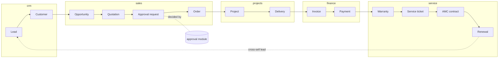
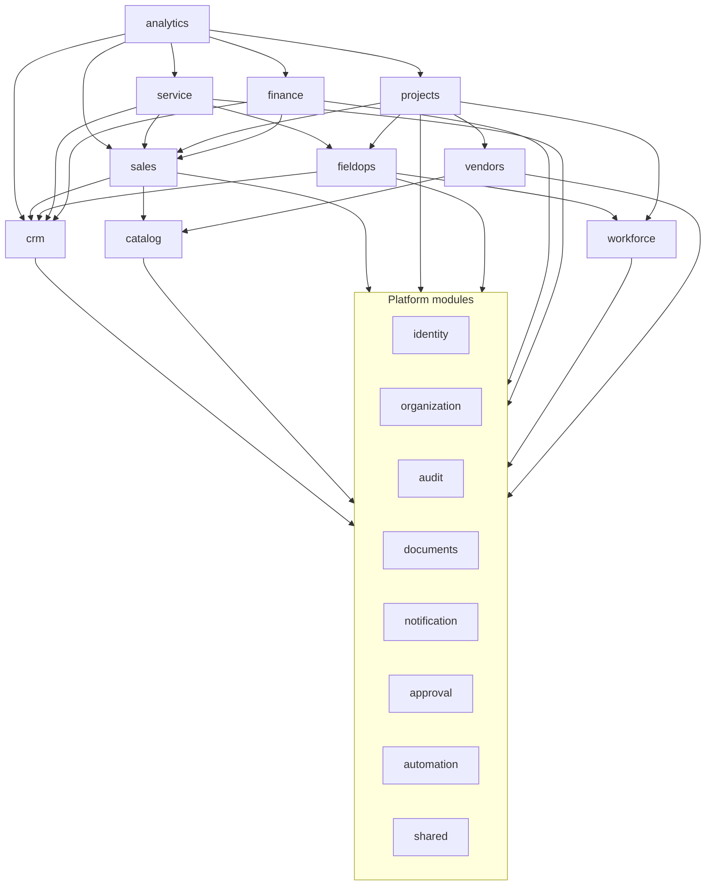

# 02. Module Boundaries

A module is a slice of the business with its own data, rules, API and screens. The same module names are used in the backend (Java packages), the database (PostgreSQL schemas), the REST API (URL prefixes), the permissions (`module.resource.action`) and the frontend (feature folders). One name, one owner, everywhere.

## Module catalogue

### Platform modules

Used by every business module. They contain no lifecycle logic.

| Module | Owns | Why separate |
|--------|------|-------------|
| `shared` | Value types (`Money`, `Percentage`, `PhoneNumber`, ids), base entity, paging types, error types | A tiny kernel of types every module needs. **No business logic, no tables.** Kept small on purpose: a growing shared kernel is how modules silently couple. |
| `identity` | Users, credentials, roles, permissions, role assignments with scope, refresh tokens | Security must be one place, reviewed as one unit. |
| `organization` | Company profile, branches, departments, **verticals**, vertical configuration (pipeline stages, custom field definitions, templates), document numbering sequences, tax settings, business settings | Everything that makes behaviour configurable instead of hardcoded (project rule 5). |
| `audit` | Append-only audit log | Every module writes to it; nobody updates or deletes it. |
| `documents` | File metadata, folders, links from files to any business record, generated PDFs | One place for access control and retention of files ([10](10-file-storage-architecture.md)). |
| `notification` | Templates, outbound email/SMS/WhatsApp, in-app notifications, delivery log | Providers change; business modules only say "notify X about Y". |
| `approval` | Approval policies, approval requests, decisions | Many lifecycle steps need approval (discount, quotation, purchase order, credit note, expense). One engine, many callers ([09](09-workflow-architecture.md)). |
| `automation` | User-defined rules (when event X and condition Y, then notify / create task / assign), reminders | Lets the business add follow-up rules without code changes. Starts small. |

### Business modules

| Module | Owns (aggregates) | Lifecycle stages owned |
|--------|------------------|------------------------|
| `crm` | Lead, Customer, Contact, Site, Activity (call, meeting, follow-up, note) | Lead, Customer, Cross-sell (as lead source) |
| `catalog` | Product, Service item, Price list, Bundle/kit template per vertical | (reference data for quoting) |
| `sales` | Opportunity, Quotation (versions, lines), Order | Opportunity, Quotation, Approval (requests it), Order |
| `projects` | Project, Milestone, Task, Material requirement, Delivery (handover) | Project, Delivery |
| `fieldops` | Work order, Visit, Schedule slot, Checklist, Customer sign-off | Execution of on-site work for projects and service |
| `finance` | Invoice, Payment, Receipt, Credit note, Vendor bill, Tax lines, Ledger export | Invoice, Payment |
| `service` | Warranty, Service ticket, AMC contract, AMC visit plan, Renewal | Warranty, Service, AMC, Renewal |
| `workforce` | Employee, Team, Skill, Attendance, Availability, Leave | (people capacity for projects and field work) |
| `vendors` | Vendor, Vendor contact, Purchase order, Goods receipt | (supply for projects) |
| `analytics` | Read models, report definitions, dashboard queries | (none; read-only consumer) |
| `ai` | Reserved. No code until a use case is approved. | (none) |

**Why these cuts.** Each module is a set of things that change together, for the same people, for the same reasons. Sales changes when the commercial process changes; finance changes when tax law changes; field ops changes when how technicians work changes. Cutting along those lines keeps most changes inside one module.

**Why `fieldops` is separate from `projects` and `service`.** A technician's day mixes installation visits (projects) and repair/AMC visits (service). One scheduling and dispatch model serves both. A work order carries a *source reference* (`PROJECT_TASK`, `SERVICE_TICKET`, `AMC_VISIT`) instead of depending on either module.

**Why verticals are not modules.** CCTV, Solar and Interior Design all go through the same lifecycle. Their differences are data: stages, fields, templates, thresholds, checklists, tax rates. Code-per-vertical would duplicate the lifecycle seven times. See D-02.3.

**Why no `inventory` module yet.** Material requirements live in `projects` and purchasing in `vendors`. Stock-keeping (warehouses, stock ledger) was not requested; adding it now would be a future module (project rule: implement only what is asked). The boundary is reserved.

## Lifecycle ownership



## Dependency rules



Arrows mean "may call the public interface of". The rules:

1. **Calls go upstream only.** A module may call modules earlier in the lifecycle or platform modules. `sales` may read a customer from `crm`; `crm` never calls `sales`.
2. **Reactions go downstream through events.** When something upstream needs to cause work downstream (an order is confirmed, so a project must be created), the upstream module publishes an event and the downstream module listens ([08](08-event-architecture.md)). This keeps the graph acyclic.
3. **The graph must stay acyclic.** A new arrow that creates a cycle is redesigned as an event.
4. **No module reads another module's tables or repositories.** Not through JPA, not through native SQL. (Project rule 3.) The only exception is `analytics`, which reads database **views** that the owning modules publish for reporting ([05](05-database-architecture.md)).
5. **No JPA relationships across modules.** A `Quotation` stores `customerId` (a UUID), not a `@ManyToOne Customer`. This prevents lazy-loading across boundaries and keeps each module's persistence model private.

## What a module exposes

Every module has exactly one public package, `api`. Everything else is internal.

```
com.pawanputra.bos.sales
├── api/                          ← PUBLIC: other modules may import only this
│   ├── QuotationApi.java          interface: queries and commands other modules may use
│   ├── OrderApi.java
│   ├── dto/OrderSummary.java      immutable records, no entities
│   └── event/OrderConfirmed.java  events this module publishes
├── internal/                     ← PRIVATE
│   ├── domain/                    entities, value objects, state machines, rules
│   ├── persistence/               Spring Data repositories
│   ├── service/                   use-case services implementing the api interfaces
│   └── listener/                  handlers for events from other modules
└── web/                          ← PRIVATE: REST controllers and request/response models
```

- **Public interfaces return DTO records, never entities.** Entities leak lazy loading, mutability and internal fields.
- **Events are part of the public contract.** Renaming or removing a field in an event is a breaking change to every listener.
- **Controllers are not a module API.** Modules never call each other over HTTP inside the monolith.

## Enforcement

**Decision.** Boundaries are enforced by an automated architecture test that fails the build when: a class imports another module's non-`api` package; a module's dependencies form a cycle; or an entity has a JPA relationship to another module's entity. Until the enforcement library is approved (see open decision OD-1 in the [decision log](13-decision-log.md)), the rules are enforced in code review using this document.

**Why.** Boundaries that rely on discipline erode within months. A failing build is cheaper than a review argument.

**Rejected.** *A separate Maven module per domain* gives compiler-enforced boundaries, but with ~20 modules (each split into api + implementation) the build becomes heavy and refactoring across boundaries in the early, fast-changing phase becomes painful. We can move to that later for a module that has stabilised.

## Decisions

### D-02.1 One public `api` package per module

See above. **Rejected:** *all public classes are fair game* (Java's default visibility does not work across sub-packages, so without a convention everything becomes reachable).

### D-02.2 Upstream calls, downstream events

**Why.** Direct calls are simple and transactional, so they are preferred where the dependency direction is natural (a quotation needs customer details now). Events are used only where a direct call would point backwards in the lifecycle. This gives the simplicity of calls and the decoupling of events, each where it fits.

**Rejected.** *Events for everything:* makes simple reads asynchronous and hard to follow. *Calls for everything:* creates cycles (`sales` → `projects` → `sales`).

### D-02.3 Vertical differences as configuration

**Decision.** `organization` holds per-vertical configuration: pipeline stages, required fields, custom field definitions, quotation and invoice templates, checklists for field work, approval thresholds, default tax codes, warranty and AMC terms. Business records carry `vertical_id` and an `attributes` JSONB column for vertical-specific fields validated against the configured definitions.

**Why.** Seven verticals with one lifecycle. Examples of real differences: Solar needs roof area, sanctioned load and subsidy scheme; CCTV needs camera count and recording days; Real Estate needs property type and carpet area. These are fields and rules, not different processes. Configuration lets the business add a vertical or field without a release.

**Rejected.** *A module per vertical:* seven copies of quoting, invoicing and service logic. *Entity-attribute-value tables:* very hard to query and validate; JSONB with defined schemas gives flexibility while keeping one row per record.

### D-02.4 Reserved but empty modules

`ai` and a future `inventory` are named so their boundaries are not accidentally absorbed by other modules, but no code or tables are created until each is requested.
