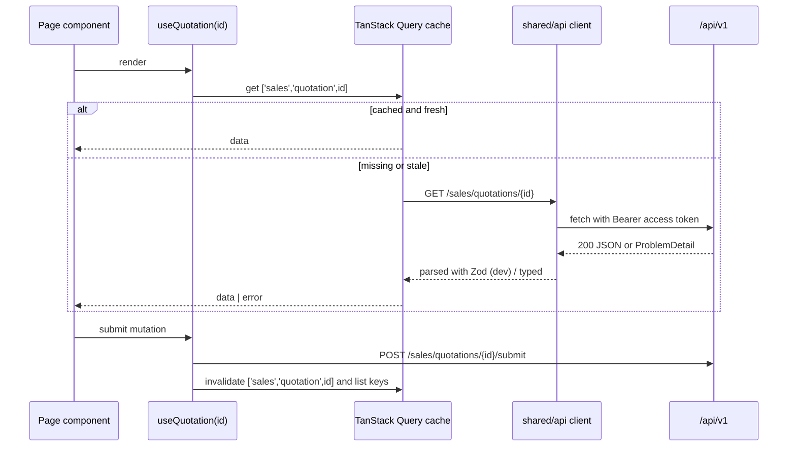

# 03. Frontend Architecture

## Stack and the job each library does

| Concern | Library | Why this one |
|---------|---------|-------------|
| Language | TypeScript (strict mode) | Business forms have many fields and states; types catch mismatches with the API before users do. |
| Build / dev server | Vite | Fast dev server and builds; outputs plain static files Nginx can serve. |
| Routing | React Router | Nested layouts (shell → module → record tabs) and route-level code splitting. |
| Server state | TanStack Query | Caching, background refetch, retries, invalidation after mutations. Almost all state in this app is server state. |
| Forms | React Hook Form | Performs well with large forms (quotations with many lines) because inputs are uncontrolled by default. |
| Validation | Zod | One schema gives both runtime validation and the TypeScript type; plugs into React Hook Form via a resolver. |
| Styling | Tailwind CSS | Consistent spacing and responsive layout without writing one-off CSS files. |
| Components | shadcn/ui | Accessible primitives copied into our repo, so we own and can adjust them; no runtime component-library lock-in. |
| Icons | Lucide | Matches shadcn/ui; tree-shakeable. |
| Tables | TanStack Table | Headless: works with our own table UI and server-side paging, sorting and filtering. |
| Charts | Recharts | Declarative React charts for dashboards; enough for KPI and trend charts. |

**Not used, on purpose.** No global client-state library (Redux, Zustand): server state is in TanStack Query and the little remaining UI state (sidebar open, current filters) lives in component state or the URL. No CSS-in-JS. No second component library.

## Folder structure

Feature folders mirror backend modules, so a developer working on "quotations" finds frontend and backend code under the same module name.

```
frontend/
├── index.html
├── vite.config.ts
├── src/
│   ├── main.tsx                  bootstraps providers and router
│   ├── app/
│   │   ├── router.tsx            top-level routes, lazy-loads each module's routes
│   │   ├── providers.tsx         QueryClientProvider, auth provider, theme, toasts
│   │   ├── layout/               app shell: sidebar, top bar, breadcrumbs, vertical switcher
│   │   └── error/                route error boundary, 404, 403 pages
│   ├── shared/
│   │   ├── ui/                   shadcn/ui components (button, dialog, form, table...)
│   │   ├── components/           composed reusable pieces: DataTable, PageHeader, StatusBadge,
│   │   │                         MoneyInput, EmptyState, ErrorState, LoadingState, FileUploader
│   │   ├── api/                  http client, ProblemDetail parsing, paging types, query-key helpers
│   │   ├── auth/                 session, current user, permission hooks (usePermission)
│   │   ├── lib/                  formatting (INR, dates in IST), utilities
│   │   └── hooks/
│   └── modules/
│       ├── crm/
│       │   ├── index.ts          PUBLIC surface: routes + anything other modules may reuse
│       │   ├── routes.tsx
│       │   ├── api/              typed API functions + TanStack Query hooks + query keys
│       │   ├── schemas/          Zod schemas for forms and responses
│       │   ├── pages/            route components (LeadListPage, CustomerDetailPage)
│       │   └── components/       module-private components
│       ├── sales/
│       ├── projects/
│       ├── fieldops/
│       ├── finance/
│       ├── service/
│       ├── workforce/
│       ├── vendors/
│       ├── analytics/
│       └── admin/                identity, organization, vertical configuration screens
└── tests/e2e/                    Playwright specs
```

### Boundary rules (same idea as the backend)

1. A module imports from `shared/` and from another module's `index.ts` only, never from another module's internal folders.
2. `shared/` never imports from `modules/`.
3. Enforced with ESLint's `no-restricted-imports` rule (ESLint already comes with the Vite React TypeScript template), so lint fails on violations.

**Why.** Without these rules, a "customer picker" gets copied into five modules or deep-imported from one, and changes ripple everywhere. Project rule 2 (reuse, no duplicates) needs a clear home for shared pieces: `shared/components` for generic ones, a module's `index.ts` for domain ones (e.g. `CustomerPicker` exported by `crm`).

## Data flow



### Conventions

- **Query keys** are built by a per-module key factory: `salesKeys.quotation(id)`, `salesKeys.quotations(filters)`. One place to invalidate correctly.
- **Mutations** invalidate the affected keys on success. No optimistic updates for money or status transitions: the server decides and the UI shows its answer.
- **The HTTP client** attaches the access token, refreshes it once on 401 and retries, parses RFC 7807 Problem Details into a typed error, and sends an `Idempotency-Key` for operations that require one ([06](06-api-architecture.md)).
- **URL as state.** List filters, sort and page live in the query string so lists are shareable and survive refresh.
- **Dates** are sent and received as ISO-8601 UTC and displayed in Asia/Kolkata. **Money** is sent as a decimal string with currency, never a JavaScript float, and formatted as INR.

## Forms and validation

- Each form has a Zod schema in `schemas/`. React Hook Form uses it through the Zod resolver.
- The Zod schema mirrors the backend Bean Validation rules for fast feedback. **The backend remains the authority.** Server validation errors (`422` with field errors) are mapped back onto form fields.
- Vertical-specific custom fields are rendered from the field definitions served by `organization`, and their Zod schema is built at runtime from those definitions, so a new field configured by an admin appears without a frontend release.

**Why Zod both ways.** Forms validate user input; responses are also parsed with Zod in development builds to catch API contract drift early, and skipped in production builds for speed.

## Screen states (project rule 7)

Every data-driven screen handles four states with shared components so they look and behave the same everywhere:

| State | Component | Behaviour |
|-------|-----------|-----------|
| Loading | `LoadingState` / skeleton rows | Skeletons sized like the final content to avoid layout jump. |
| Empty | `EmptyState` | Explains what goes here and offers the primary action if the user is allowed to take it. |
| Error | `ErrorState` | Human message from the ProblemDetail, a retry button, and the request id for support. |
| Success | page content | Mutations confirm with a toast; destructive actions confirm with a dialog first. |

## Authorization in the UI

`usePermission('sales.quotation.approve')` hides or disables actions the user cannot take, and route guards show a 403 page. This is **for usability only**; the server enforces every permission ([07](07-security-architecture.md)). The current user's permissions and data scopes are loaded once after login and cached.

## Responsiveness and accessibility

- Mobile-first Tailwind breakpoints. Field-staff screens (today's jobs, visit check-in, photo upload, sign-off) are designed for phones first; back-office screens for desktop first but usable on tablets.
- Wide tables collapse to card lists below the `md` breakpoint.
- shadcn/ui (built on accessible primitives) for keyboard navigation and focus management; every input has a label; colour is never the only status signal (status badges carry text).
- No decorative animation; only the minimal transitions shadcn/ui components ship with.

## Performance

- Each module's routes are lazy-loaded, so a field technician never downloads finance code.
- Lists are server-paginated (default 25 rows). No "load everything then filter".
- Images are uploaded directly to object storage and displayed through thumbnails ([10](10-file-storage-architecture.md)).

## Decisions

### D-03.1 Feature folders mirroring backend modules
**Why.** One vocabulary across the stack; ownership is obvious. **Rejected:** *type-first folders* (`components/`, `pages/`, `hooks/` at the top level) which scatter one feature across the tree.

### D-03.2 TanStack Query as the only state store for server data
**Why.** Removes hand-written loading/error/caching logic and stale-data bugs. **Rejected:** *Redux or similar for server data*, which re-implements caching by hand.

### D-03.3 Hand-written typed API functions per module, OpenAPI as the contract
**Why.** Keeps the toolchain to the agreed stack. The backend's OpenAPI document is the reference that API functions and Zod schemas must match. Generating TypeScript types from OpenAPI would remove this manual step; that needs a code generator outside the agreed stack, so it is open decision OD-3.

### D-03.4 shadcn/ui components owned in-repo
**Why.** Components are source files we can change for our needs (e.g. Indian number formatting in inputs) without forking a library.
