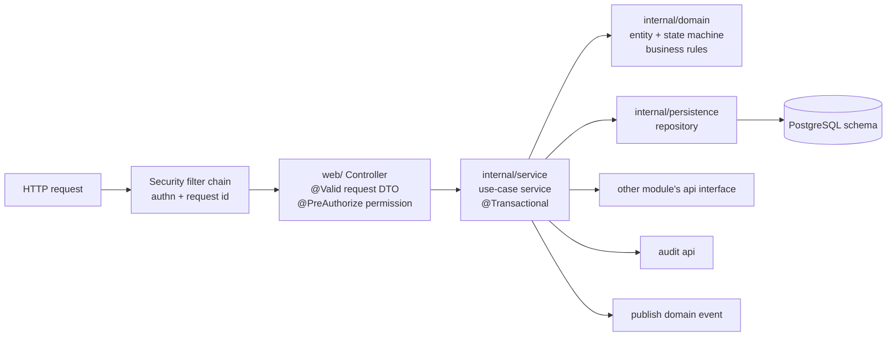

# 04. Backend Architecture

## Stack and the job each piece does

| Concern | Technology | Use |
|---------|-----------|-----|
| Language / runtime | Java 21 | Records for DTOs and events, sealed types for state results, pattern matching, virtual threads available for blocking I/O. |
| Application framework | Spring Boot | Dependency injection, configuration, embedded server, Actuator. |
| Security | Spring Security | Authentication filters, method-level authorization ([07](07-security-architecture.md)). |
| Persistence | Spring Data JPA + Hibernate | Entities and repositories per module. Native SQL / views for reporting. |
| Migrations | Flyway | Versioned, reviewed schema changes ([05](05-database-architecture.md)). |
| Validation | Bean Validation (Jakarta) | Request DTO validation; custom validators for business-format fields (GSTIN, PAN, phone). |
| Scheduling | Spring Scheduler | Reminders, AMC visit generation, renewal alerts, outbox relay, read-model refresh ([09](09-workflow-architecture.md)). |
| Internal events | Spring application events | Decoupled reactions between modules ([08](08-event-architecture.md)). |
| API documentation | OpenAPI (springdoc) | Generated from controllers and DTOs, served at `/api/v1/docs` in non-production environments. |
| Operations | Spring Boot Actuator | Health, readiness, metrics ([12](12-deployment-architecture.md)). |
| Cache | Redis via Spring Cache | Reference data and permission sets. |

**Build tool.** Maven, with the Spring Boot parent and the Maven Wrapper committed. *Why:* the stack does not name one; Maven is the most common Spring Boot default, declarative, and well supported by every IDE and CI system. Gradle would also work; there is no requirement it would serve better. (Recorded in the decision log so it can be overruled before any code is written.)

## Repository layout

```
/
├── backend/                     Spring Boot application (Maven)
├── frontend/                    React application (Vite)
├── deploy/                      Dockerfiles, docker-compose files, nginx config
└── docs/architecture/           these documents
```

**Why one repository.** Frontend and backend change together for most features (new field → migration, DTO, form). One pull request, one review, one version.

## Backend package structure

```
backend/src/main/java/com/pawanputra/bos/
├── BusinessOsApplication.java
├── shared/                      kernel types (see 02)
├── platform/
│   ├── web/                     global exception handler, request-id filter, paging resolver
│   ├── security/                Spring Security config, JWT handling, permission evaluator
│   ├── persistence/             base entity, auditing fields, JPA config
│   ├── events/                  outbox table writer + relay
│   ├── idempotency/             idempotency-key store and filter
│   └── config/                  typed @ConfigurationProperties
├── identity/   { api, internal, web }
├── organization/
├── audit/
├── documents/
├── notification/
├── approval/
├── automation/
├── crm/
├── catalog/
├── sales/
├── projects/
├── fieldops/
├── finance/
├── service/
├── workforce/
├── vendors/
└── analytics/
```

`platform/` is technical infrastructure (no business rules, no business tables except outbox and idempotency). Business modules follow the `api / internal / web` layout described in [02](02-module-boundaries.md).

## Inside a module: request to database



### Responsibilities per layer

| Layer | Does | Does not |
|-------|------|----------|
| Controller (`web/`) | Map HTTP to a use case; validate request shape with Bean Validation; declare required permission; map result to response DTO | Contain business rules; touch repositories; start transactions |
| Use-case service (`internal/service`) | One public method per business operation (`submitQuotation`, `recordPayment`); owns the transaction boundary; checks data scope; loads aggregates; calls domain methods; writes audit; publishes events | Know about HTTP |
| Domain (`internal/domain`) | Entities with behaviour: `quotation.submit()`, `invoice.applyPayment(amount)`; state transition guards; invariants (totals, tax) | Call repositories or other modules |
| Persistence (`internal/persistence`) | Spring Data repositories, query methods, specifications for filtered lists | Be used outside the module |

**Why a rich domain model for core aggregates.** Lifecycle rules (a quotation cannot be edited after approval; an invoice cannot be paid beyond its balance; a payment cannot be recorded twice) belong next to the data they protect, so every path through the system enforces them. Simple reference data (e.g. a department) can use plain entities without ceremony; we do not force patterns where there is no rule to protect.

**Why the service owns the transaction.** One business operation equals one transaction: state change, audit record and outbox event commit together or not at all.

## Cross-cutting conventions

### Transactions
- `@Transactional` on use-case service methods only. Read operations use `readOnly = true`.
- Calls to another module's `api` within a use case join the same transaction. This is the main benefit of the monolith: e.g. confirming an order and reserving its document number are atomic.
- External calls (email, SMS, payment gateway) never happen inside a database transaction; they run from after-commit listeners or the outbox relay.

### Optimistic locking
Every aggregate root has a `version` column (`@Version`). Updates send the version they read; a mismatch returns `409 Conflict`. *Why:* two people editing the same quotation is realistic; silently losing one person's changes is not acceptable.

### Validation in three places, each with a purpose
1. **Request DTO** (Bean Validation): shape and format. `@NotBlank`, `@Email`, `@Positive`, custom `@Gstin`.
2. **Domain**: business invariants that hold regardless of entry point (discount ≤ allowed maximum, dates in order).
3. **Database**: constraints as the last line of defence (`NOT NULL`, `CHECK`, unique, foreign keys).

### Configurable business rules (project rule 5)
Thresholds, defaults and terms (discount approval limits, payment terms, warranty months, AMC visit frequency, numbering formats, tax codes) are read from `organization` settings, cached in Redis, never hardcoded. Application config (`application.yml`) holds only technical settings, and secrets come from environment variables.

### Errors
Business errors are typed exceptions (`BusinessRuleViolation`, `NotFound`, `ConflictingVersion`, `InvalidStateTransition`) mapped by one global `@RestControllerAdvice` to RFC 7807 Problem Details ([06](06-api-architecture.md)). Unexpected exceptions return a generic 500 with the request id; details go to logs only.

### Mapping
DTO ↔ entity mapping is written by hand in small mapper classes per module. *Why:* explicit, debuggable and needs no extra library; the number of DTOs per module is manageable. A mapping library can be revisited if mappers become a measurable burden.

### Time, money, ids
- `Instant` in the domain and `timestamptz` in the database; business dates (`LocalDate`) where only a date matters (invoice date, due date). Display time zone Asia/Kolkata is a setting.
- `Money` value type wrapping `BigDecimal` + currency (default INR). Rounding rules for tax lines live in `finance`, configured per tax code.
- UUID primary keys, plus human-readable document numbers from `organization` numbering ([05](05-database-architecture.md)).

### Logging and request tracing
- Every request gets a request id (from Nginx's `X-Request-Id` or generated), stored in the logging context and returned in error responses.
- Structured JSON logs in deployed environments; never log secrets, tokens, passwords or full card/bank details.

### Concurrency on hot paths
Document number allocation and payment application use row-level locks (`SELECT ... FOR UPDATE`) inside the transaction, so two simultaneous invoices cannot get the same number and two simultaneous payments cannot over-pay an invoice.

## Decisions

### D-04.1 Layered modules with a rich domain for core aggregates
**Rejected:** *anaemic entities + fat services* (rules spread across services and get bypassed), *full hexagonal architecture with ports/adapters for every module* (more interfaces than the team needs; we use adapters only where an external provider exists: notification, payment gateway, storage).

### D-04.2 Hand-written mappers
**Rejected:** *returning entities from controllers* (leaks internals, lazy-loading errors, accidental mass assignment).

### D-04.3 No reactive stack
**Decision.** Spring MVC (servlet), blocking JDBC. **Why:** JPA is blocking; the workload is CRUD and workflow, not high-concurrency streaming. Java 21 virtual threads can be enabled if thread pools become a bottleneck. **Rejected:** *WebFlux/R2DBC*, which conflicts with JPA and adds complexity without benefit here.
