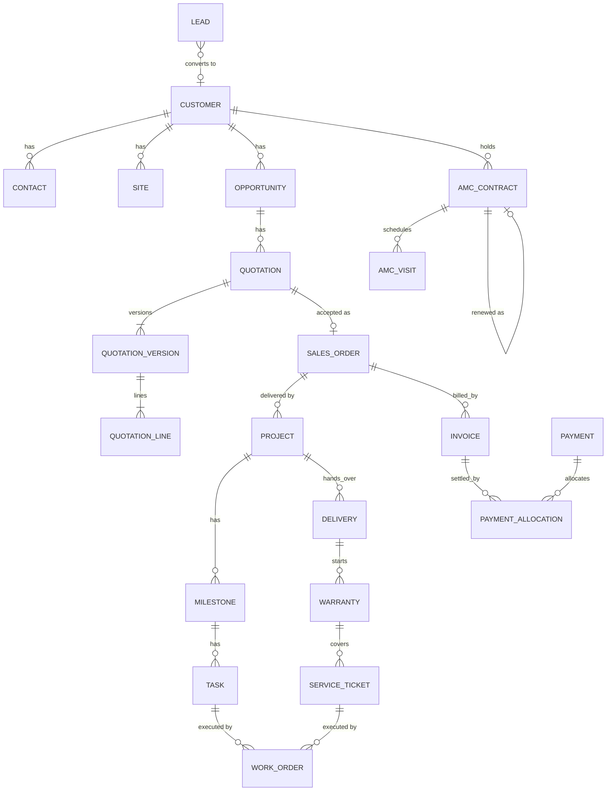

# 05. Database Architecture

## One database, one schema per module

**Decision.** A single PostgreSQL database. Each module owns one PostgreSQL schema with the same name (`crm`, `sales`, `finance`, ...). Platform tables live in `platform` (outbox, idempotency, scheduler locks), `identity`, `organization`, `audit`, `documents`, `notification`, `approval`, `automation`.

**Why.**
- One database keeps transactions across modules possible (order confirmation + project creation), and backups and operations simple.
- Schemas make ownership visible in every query and every tool: `sales.quotation` is obviously owned by `sales`. Database grants can later restrict a role to its schema if a module is ever extracted.
- It mirrors the module boundaries in [02](02-module-boundaries.md), so the boundary is the same in code and data.

**Rejected.** *Database per module* (loses local transactions, multiplies operations work, for no current benefit). *Everything in `public`* (ownership becomes guesswork once there are 150+ tables).

## Standard columns

Every business table has:

| Column | Type | Purpose |
|--------|------|---------|
| `id` | `uuid` primary key | Generated by the application (time-ordered UUID v7 where supported). Safe to expose in URLs; not guessable; allows creating ids before insert. |
| `created_at`, `updated_at` | `timestamptz` | Stored in UTC. |
| `created_by`, `updated_by` | `uuid` | User id from `identity`. |
| `version` | `bigint` | Optimistic locking. |
| `vertical_id` | `uuid` | On records that belong to a vertical (leads, opportunities, quotations, orders, projects, tickets, contracts, invoices). |
| `attributes` | `jsonb` | Only on records that support vertical-specific custom fields. Validated by the application against field definitions in `organization`. |

Records that must be traceable (customers, quotations, orders, invoices, payments) are **never hard-deleted**. They move to a terminal status (`CANCELLED`, `VOID`) or carry `archived_at`. Financial documents are immutable once issued: corrections are made with new documents (credit notes, revised quotations).

**Why UUIDs instead of sequences.** Ids are created in the application, can be referenced in events and idempotency keys before the insert, do not reveal business volume, and keep working if a module is ever extracted. The cost (wider index) is irrelevant at this scale; v7 ordering avoids the random-insert index penalty of v4.

**Why human-readable numbers as well.** People need `QT-SOLR-2026-00042` on paper and on the phone. Numbers come from `organization.number_sequence` (one row per document type, vertical and financial year, format configurable), allocated with a row lock inside the creating transaction so they are gap-free per sequence where the law requires it (invoices).

## Data types

| Data | Type | Rule |
|------|------|------|
| Money | `numeric(19,4)` + `currency char(3)` | Never floating point. Rounded to 2 decimals at document-total level by `finance` rules. |
| Quantities | `numeric(19,4)` | Solar kW, cable metres, hours. |
| Percentages | `numeric(7,4)` | Discount and tax rates. |
| Statuses | `varchar` + `CHECK` constraint | Readable in SQL, easy to extend via migration. Not PostgreSQL enums (painful to alter). |
| Business date | `date` | Invoice date, due date, warranty end. |
| Moments | `timestamptz` | Everything else. |
| Phone, GSTIN, PAN | `varchar` with format checks | Normalised before storage (E.164 phones). |

## Key relationships (simplified)

Notes:
- **Quotation versions.** A quotation is a container; each revision is an immutable version. Approval and acceptance refer to a specific version, so what the customer accepted can always be reproduced.
- **Payments vs allocations.** One payment can settle several invoices and one invoice can be paid in instalments; allocations make both possible and keep balances exact.
- **Work orders** link to their source (`source_type`, `source_id`) rather than to `projects` or `service` tables, matching the module rules.

## Cross-module references

**Decision.** Tables reference other modules' records by `uuid` columns **with foreign-key constraints** (e.g. `sales.quotation.customer_id → crm.customer.id`). JPA entities do **not** map these as relationships; they hold the id only.

**Why.** Inside one database, foreign keys are free integrity: an order can never point to a customer that does not exist. Not mapping them in JPA keeps each module's object model private and prevents cross-module lazy loading. If a module is ever extracted, its foreign keys are dropped in that migration; that cost is known and small.

**Rejected.** *No cross-schema foreign keys* (purer, but gives up integrity we get for free today).

## Migrations (Flyway)

- All schema changes are Flyway SQL migrations in `backend/src/main/resources/db/migration/`. No `ddl-auto` beyond `validate`.
- File naming uses a timestamp plus module to avoid version collisions between parallel branches:
  `V2026_10_05_1200__crm_create_lead_tables.sql`
- One migration touches one module's schema (plus at most a cross-module foreign key it needs).
- Migrations are forward-only. A mistake is fixed by a new migration, never by editing an applied one.
- Reference data that is configuration (verticals, default roles, permission catalogue) is seeded by migrations; environment-specific data is not.
- Hibernate runs with `ddl-auto=validate`, so the application refuses to start if entities and schema disagree.

**Why Flyway SQL rather than Java migrations.** SQL is reviewable by anyone who knows the database, and PostgreSQL-specific features (partial indexes, `CHECK`, views) are written directly.

## Indexing and query rules

- Every foreign key is indexed.
- List screens filter and sort on indexed columns; composite indexes are designed per list screen (e.g. `(vertical_id, status, created_at desc)` for the lead list).
- Partial indexes for "open" work: `WHERE status IN ('OPEN','IN_PROGRESS')`.
- Text search on names, phones and document numbers uses PostgreSQL full-text search and the `pg_trgm` extension for partial and fuzzy matches. *Why not a search engine:* volumes are small (tens or hundreds of thousands of rows); PostgreSQL handles this well with no extra system.
- All list queries are paginated. No unbounded `findAll()` in request paths.
- N+1 queries are prevented with fetch joins or entity graphs inside the module; tests assert query counts on the main list endpoints.

## Reporting and analytics

**Decision.** Each module publishes **reporting views** in its own schema (e.g. `finance.v_invoice_report`) as its reporting contract. The `analytics` module reads only those views, plus materialised views it owns in an `analytics` schema, refreshed on a schedule.

**Why.** Dashboards need joins across modules (revenue by vertical by salesperson). Reading views keeps the owning module in control of its tables while giving analytics efficient SQL. Materialised views keep heavy dashboards from loading transactional tables during business hours.

**Rejected.** *A separate data warehouse or OLAP database* (unneeded at this scale; can be fed from these views later).

## Audit, outbox, idempotency tables

| Table | Purpose | Detail in |
|-------|---------|-----------|
| `audit.audit_log` | Append-only record of business operations with before/after values | [07](07-security-architecture.md) |
| `platform.outbox_event` | Events that must reach their listeners even after a crash | [08](08-event-architecture.md) |
| `platform.idempotency_key` | Stored responses for retried payment and webhook requests | [06](06-api-architecture.md) |
| `platform.scheduler_lock` | Ensures a scheduled job runs on one instance only | [09](09-workflow-architecture.md) |

`audit.audit_log` is partitioned by month once it grows (PostgreSQL native partitioning) so old partitions can be archived without touching recent data.

## Backups and data protection

See [12](12-deployment-architecture.md). In short: daily full backups plus continuous WAL archiving for point-in-time recovery, restore tested regularly. Personal data (phones, addresses, identity numbers) is limited to the fields the business needs; identity document numbers, if stored, are masked in API responses for roles that do not need them.
