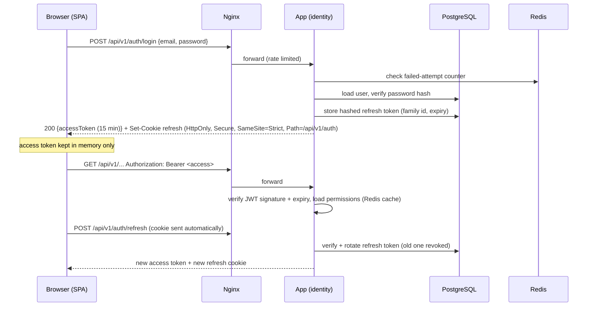
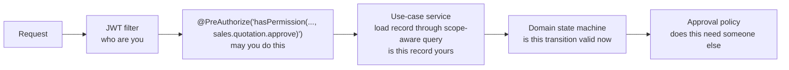

# 07. Security Architecture

Security is enforced on the server, in one module (`identity`) plus the shared security configuration in `platform/security`. The frontend only mirrors permissions to hide buttons.

## Threats we design against

| Threat | Main controls |
|--------|--------------|
| Stolen or guessed passwords | Strong hashing, login throttling, account lockout, optional second factor later |
| Stolen tokens | Short-lived access tokens kept in memory, refresh token in `HttpOnly` cookie with rotation and reuse detection |
| Staff seeing or changing data outside their role | Permission checks on every endpoint plus data-scope filtering on every query |
| Insider changes to money or prices | Approval policies, immutable issued documents, complete audit log |
| Injection (SQL, script) | JPA parameter binding, no string-built SQL, React escaping, strict Content-Security-Policy |
| Forged or replayed webhooks | Signature verification, provider event-id idempotency |
| Leaked secrets | No secrets in source; environment-injected configuration; secret scanning in review |
| Direct access to private files | Private buckets, short-lived presigned URLs issued only after a permission check |

## Authentication



**Decision.**
- Login with email (or mobile number) and password. Passwords hashed with Spring Security's `DelegatingPasswordEncoder` using bcrypt (cost tuned to ~250 ms), so the algorithm can be upgraded later without forcing resets.
- On success, issue a **signed JWT access token** (15 minutes, contains user id and a permissions version, not the permission list) and a **refresh token** (random, 256-bit, stored hashed in `identity.refresh_token`, valid 7 days by default, configurable).
- Access token is held in JavaScript memory only. Refresh token lives only in an `HttpOnly; Secure; SameSite=Strict` cookie scoped to the auth path.
- Refresh tokens **rotate** on every use. Reusing an old one revokes the whole token family (sign of theft) and forces login.
- Logout revokes the refresh token family. Disabling a user or changing their roles bumps their permissions version, so existing access tokens are rejected at the next request.
- Signing key comes from environment configuration and supports rotation (key id in token header).
- Login throttling: per-account and per-IP failure counters in Redis; lockout after a configurable number of failures, with exponential back-off.

**Why this design.**
- Same-origin SPA (served by Nginx) lets the refresh cookie be `SameSite=Strict`, which blocks cross-site request forgery on the only cookie-authenticated endpoint. All other endpoints use the `Authorization` header, which browsers never send automatically, so classic CSRF does not apply to them.
- Keeping the access token out of `localStorage` means a cross-site-scripting bug cannot simply read a long-lived credential.
- Stateless access tokens make each API request cheap and let us run several app instances without shared session storage. Short expiry plus a permissions version gives near-immediate revocation.
- Bearer tokens work unchanged for a future mobile app or customer portal.
- Spring Security's resource-server support validates JWTs without extra libraries.

**Rejected.**
- *Server-side sessions with a session cookie:* also a sound choice for a same-origin app, but needs a shared session store for multiple instances, CSRF tokens on every request, and does not carry over to a mobile client. Close second.
- *Long-lived JWT in `localStorage`:* readable by any injected script, cannot be revoked.
- *External identity provider (Keycloak, Auth0, etc.):* another system to run or pay for; not in the stack. Can be adopted later because authorization is separate from authentication in this design.

**Later (not v1).** Second factor (TOTP) for admin and finance roles; customer portal accounts as a separate user type.

## Authorization: RBAC with data scopes

Two questions are answered for every request:

1. **May this user perform this action?** (permission)
2. **On which records?** (data scope)

### Permissions

Permissions are fixed strings defined by code, seeded by migration, named `module.resource.action`:

```
crm.lead.read          crm.lead.create          crm.lead.convert
sales.quotation.read   sales.quotation.submit   sales.quotation.approve
finance.invoice.issue  finance.payment.record   finance.creditnote.approve
service.ticket.assign  fieldops.workorder.complete
identity.user.manage   organization.vertical.configure
```

### Roles

A role is a named set of permissions **managed by admins in the UI** (stored in `identity.role_permission`). Default roles are seeded (Owner, Admin, Vertical Manager, Sales Executive, Project Manager, Field Technician, Accounts, Service Desk, HR) but can be changed without a release.

### Data scopes

A user is assigned a role **with a scope**:

| Scope | Sees records where |
|-------|-------------------|
| `OWN` | they are the owner/assignee |
| `TEAM` | the owner/assignee is in a team they manage |
| `VERTICAL` | `vertical_id` is in their assigned verticals |
| `BRANCH` | `branch_id` is in their assigned branches |
| `ALL` | no restriction |

Example: a Solar sales executive has *Sales Executive @ OWN*; the Solar head has *Vertical Manager @ VERTICAL(Solar)*; the accountant has *Accounts @ ALL*.

### Enforcement points



- **Permission check** on the controller method via a custom `PermissionEvaluator` (one annotation per endpoint, reviewed in OpenAPI docs).
- **Data scope** applied inside the module's repository queries using the current user's scope (a reusable `Specification` per module). A record outside scope returns `404`, not `403`, so its existence is not revealed.
- **State rules** in the domain ([09](09-workflow-architecture.md)).
- **Separation of duties** via approval policies: e.g. the person who created a quotation cannot approve their own discount.
- Permission sets are cached in Redis per user and invalidated when roles or assignments change.

**Why RBAC + scopes rather than pure RBAC or full ABAC.** Pure roles cannot express "Solar head sees Solar only" without creating a role per vertical. A full attribute-based policy engine is more power than the business needs and much harder to audit. Roles plus a small fixed set of scopes covers the real cases and stays explainable to an admin.

**Field-level restrictions.** Sensitive fields (cost price, margin, salary, bank details) require an extra `*.viewSensitive` permission; DTO mappers omit them otherwise.

## Audit logging (project rule 4)

**Decision.** The `audit` module provides `AuditApi.record(...)`, called by use-case services inside the same transaction as the change.

Each entry stores: timestamp, actor user id (or `SYSTEM` / webhook source), action (`sales.quotation.approve`), entity type and id, vertical, before and after values of changed fields (JSONB), reason/comment if given, request id, IP address and user agent.

- Append-only: the application's database user has `INSERT` and `SELECT` only on `audit.audit_log`; no `UPDATE` or `DELETE`.
- What is audited: every create, update and state transition on business records; every approval decision; logins, failed logins, logouts, password and role changes; permission denials on sensitive actions; file downloads of sensitive documents; configuration changes.
- Sensitive values (passwords, tokens) are never written; personal identifiers are masked.
- Viewable per record (a "History" tab) and searchable by admins.

**Why in-transaction instead of via events.** If the business change commits, its audit record commits with it; if it rolls back, neither exists. An event-based audit could lose entries on a crash, which defeats the purpose.

## Transport and browser security

- HTTPS only (TLS 1.2+ at Nginx); HTTP redirects to HTTPS; HSTS enabled.
- Security headers from Nginx: `Content-Security-Policy` (self only, no inline scripts), `X-Content-Type-Options: nosniff`, `Referrer-Policy: same-origin`, `X-Frame-Options: DENY`, `Permissions-Policy` limited to camera (photo capture) and geolocation (visit check-in) for our own origin.
- No CORS needed (same origin). If a separate origin is ever introduced, an explicit allow-list is configured; never `*`.

## Secrets and configuration

- No secrets in the repository (project rule 5). Database credentials, JWT signing keys, storage keys, SMTP/SMS/payment provider secrets come from environment variables injected at deploy time ([12](12-deployment-architecture.md)).
- `.env` files are for local development only and git-ignored; an `.env.example` documents the names without values.
- Different secrets per environment; production secrets are accessible only to the deploy process and the owner.

## Data protection

- Personal data collected is the minimum for the business process.
- Backups are encrypted at rest ([12](12-deployment-architecture.md)).
- Customer data export and deletion requests are handled by an admin operation that anonymises personal fields while preserving financial records required by law.
