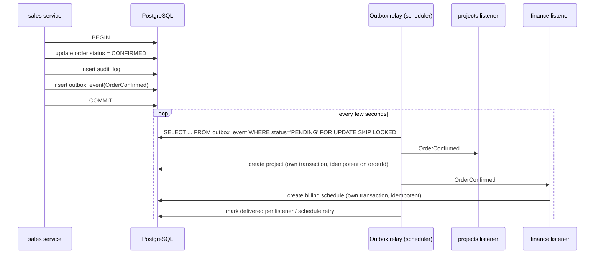

# 08. Event Architecture

## Purpose

Events let a module react to something that happened in another module without the publisher knowing about the reaction. They implement the "reactions go downstream" rule from [02](02-module-boundaries.md): `sales` confirms an order and does not need to know that `projects` creates a project, `finance` sets up billing and `notification` emails the customer.

## Mechanism: Spring application events, plus an outbox where loss is unacceptable

**Decision.** Two delivery modes, both built on Spring's event system inside the single application:

| Mode | How | Use when |
|------|-----|---------|
| **In-process, after commit** | `ApplicationEventPublisher.publishEvent(...)` in the use-case service; listeners use `@TransactionalEventListener(phase = AFTER_COMMIT)` | The reaction is useful but not business-critical, and losing it on a crash is tolerable or self-healing (refresh a cache, send an in-app notification, update a dashboard counter). |
| **Durable (transactional outbox)** | The publishing service writes the event to `platform.outbox_event` **in the same transaction** as the business change. A scheduled relay reads committed rows, publishes them as Spring events to listeners, and marks them done. | The reaction must happen (create the project for a confirmed order, start warranties on delivery, update invoice status after payment, send the customer's invoice email, process webhooks). |



**Why this design.**
- Spring events are already in the stack and need no broker.
- Plain after-commit listeners have one gap: if the process dies between commit and listener execution, the event is lost. For "order confirmed but no project created" that is a real business failure. The outbox closes the gap using only PostgreSQL, which we already run and back up.
- Publishing only after commit means listeners never see data that later rolls back.
- `FOR UPDATE SKIP LOCKED` lets several application instances run the relay safely without double-processing.

**Rejected.**
- *A message broker (Kafka, RabbitMQ) or Redis streams:* another stateful system to run, secure and back up, for traffic one PostgreSQL table handles easily. Becomes reasonable only if a module is extracted into its own service.
- *Synchronous in-transaction listeners for cross-module reactions:* couples the publisher's transaction to every listener's failure; one broken listener would block order confirmation.
- *Event sourcing:* powerful but a large shift in how data is stored and queried; unnecessary for this domain.

## Delivery guarantees and listener rules

- **At-least-once** delivery for outbox events. A listener may receive the same event twice (e.g. crash after processing but before marking done).
- Therefore **every durable listener is idempotent**, usually by a natural key: "create project for order X" checks whether a project for order X exists; "mark invoice paid for payment Y" records the payment id.
- Each listener runs in **its own transaction**. A failure in one listener does not affect others; delivery is tracked per listener.
- Failed deliveries retry with exponential back-off up to a configured limit, then are marked `FAILED` and surfaced on an admin screen and in logs/metrics for manual retry.
- **Ordering** is guaranteed per aggregate (events for the same order are relayed in creation order), not globally. Listeners must not assume ordering across different aggregates.
- Processed outbox rows are kept for a configurable retention period (default 30 days) for troubleshooting, then purged by a scheduled job.

## Event design

Events are immutable Java records in the publishing module's `api/event` package.

```java
public record OrderConfirmed(
    UUID eventId,
    Instant occurredAt,
    UUID orderId,
    String orderNumber,
    UUID customerId,
    UUID verticalId,
    UUID acceptedQuotationVersionId,
    Money orderTotal,
    UUID confirmedBy
) implements DomainEvent {}
```

Rules:
- **Past-tense names** describing a business fact: `LeadConverted`, `QuotationApproved`, `OrderConfirmed`, `DeliveryCompleted`, `InvoiceIssued`, `PaymentRecorded`, `WarrantyExpiring`, `AmcContractExpiring`.
- **Carry ids plus the few fields most listeners need**, not whole aggregates. A listener that needs more calls the publisher's `api` (an upstream call, which is allowed).
- **Versioned by evolution:** add fields freely; never remove or rename a field while a listener uses it. A breaking change gets a new event type.
- Stored in the outbox as JSON with the event type name and schema version.

## Event catalogue (initial)

| Event | Published by | Durable | Main listeners and their reaction |
|-------|-------------|---------|-----------------------------------|
| `LeadCreated` | crm | no | automation (assignment rules), notification |
| `LeadConverted` | crm | yes | sales (create opportunity if requested), analytics |
| `OpportunityStageChanged` | sales | no | analytics, automation |
| `QuotationSubmitted` | sales | yes | approval (create request when policy requires) |
| `ApprovalDecided` | approval | yes | sales / vendors / finance (apply the decision to the requesting record) |
| `QuotationAccepted` | sales | yes | sales (create order), notification |
| `OrderConfirmed` | sales | yes | projects (create project), finance (billing schedule), notification |
| `MilestoneCompleted` | projects | yes | finance (draft milestone invoice), notification |
| `WorkOrderCompleted` | fieldops | yes | projects or service (update task / ticket via source reference) |
| `DeliveryCompleted` | projects | yes | service (start warranties), finance (final invoice), crm (customer status) |
| `InvoiceIssued` | finance | yes | notification (send invoice), analytics |
| `PaymentRecorded` | finance | yes | finance (allocation follow-ups), sales (order paid status), service (activate AMC on first payment), notification (receipt) |
| `PaymentGatewayEventReceived` | finance (webhook) | yes | finance (match and record payment) |
| `ServiceTicketOpened` | service | yes | fieldops (create work order when on-site), notification |
| `WarrantyExpiring` | service (scheduled) | yes | crm (renewal / AMC lead), notification |
| `AmcContractExpiring` | service (scheduled) | yes | service (renewal opportunity), notification |
| `CustomerCrossSellSignal` | service / analytics | no | crm (suggest cross-sell lead in another vertical) |

`approval` is generic: its `ApprovalDecided` carries `subjectType` and `subjectId`, and only the module that owns that subject type acts on it. This keeps `approval` free of dependencies on business modules.

## Events vs direct calls: decision guide

| Situation | Use |
|-----------|-----|
| Need data from an upstream module to complete my operation | Direct call to its `api` |
| My operation must fail if the other step fails, and the other module is upstream | Direct call in the same transaction |
| Something downstream should happen because of my change | Durable event |
| Nice-to-have side effect (cache, counter, in-app badge) | After-commit event |
| External system call (email, SMS, gateway) | Durable event, and the listener calls the provider adapter |

## Observability

- Metrics: outbox backlog size, age of oldest pending event, delivery failures per listener (exposed through Actuator, see [12](12-deployment-architecture.md)).
- Each event carries the originating request id, so logs can follow a business operation from HTTP request through every listener.
