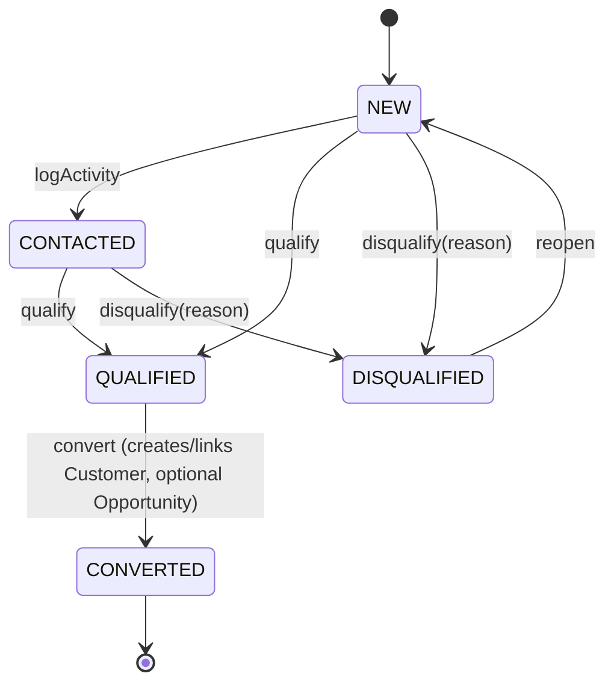
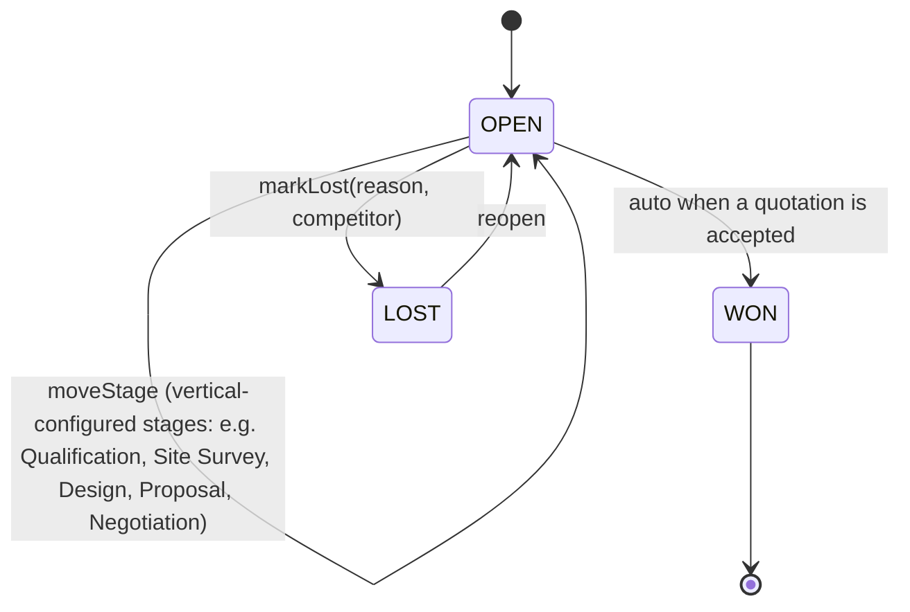
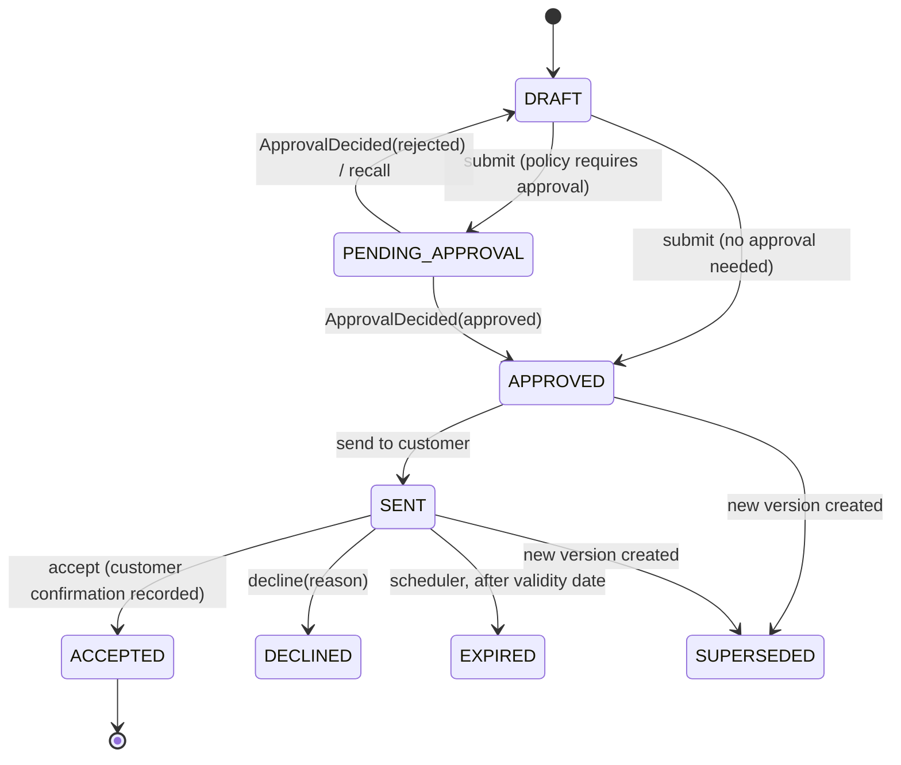
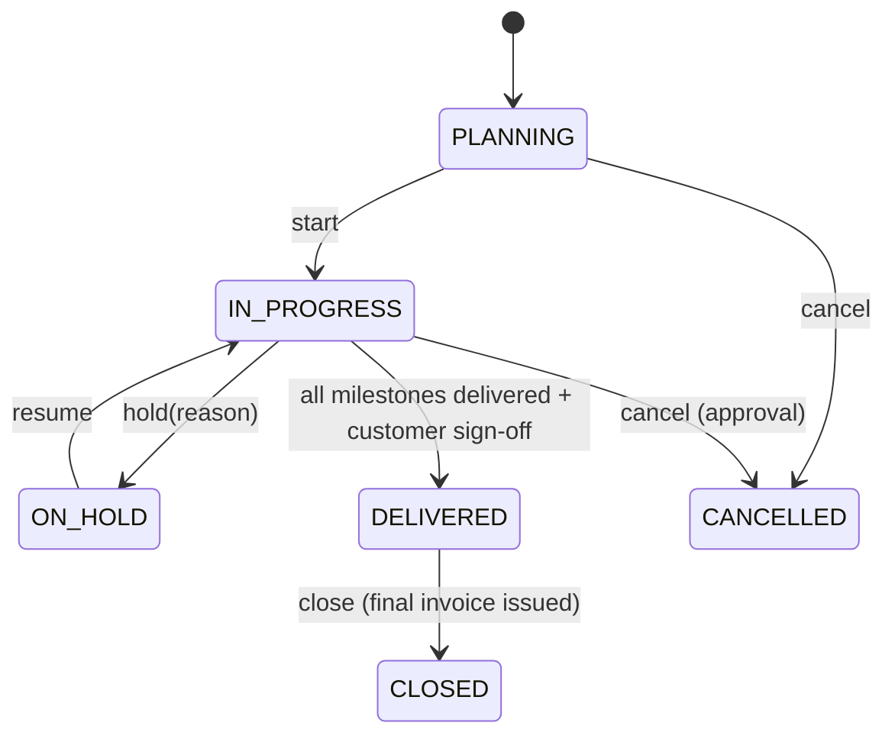
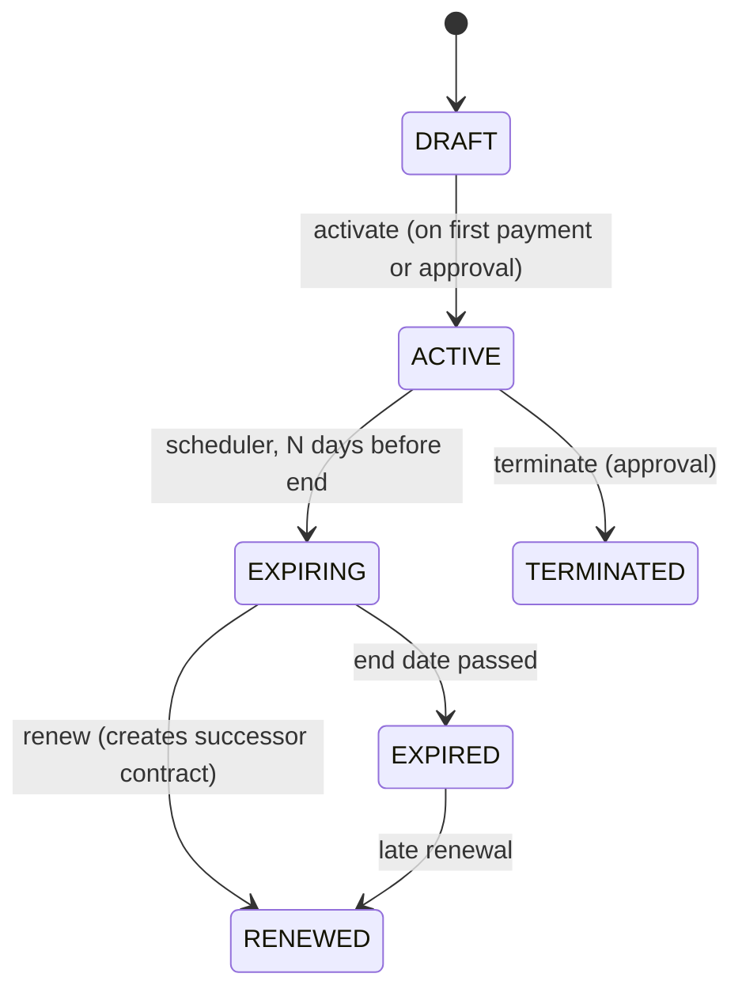
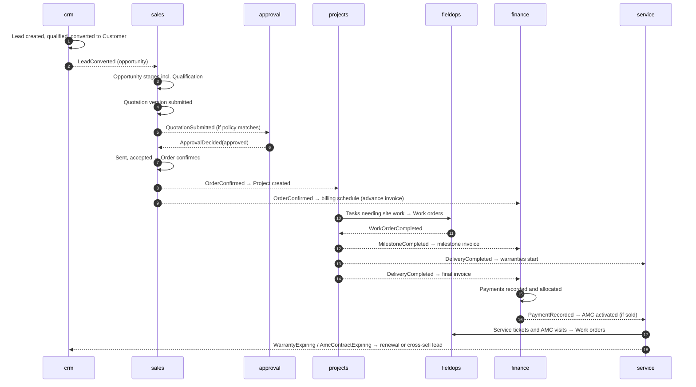

# 09. Workflow Architecture

Workflow here means three things: **state machines** for lifecycle records, **approvals** that need a second person, and **scheduled work** that happens because time passes (follow-ups, AMC visits, renewals).

## Decision: explicit state machines in code, configurable rules in data

**Decision.** Each lifecycle aggregate has its states and allowed transitions defined in its domain class (an enum of states plus guarded transition methods). What varies by business choice (who must approve, thresholds, how many days before expiry to remind, pipeline stage labels per vertical) is configuration in `organization` / `approval` / `automation` tables.

**Why.**
- The core lifecycle is the business's operating model and changes rarely; when it does, the change needs code review and tests anyway (invoices and payments have legal meaning).
- Transitions written in code are type-checked, unit-tested and visible in one place per aggregate.
- Thresholds and recipients change often and must not need a release (project rule 5), so they are data.

**Rejected.**
- *A BPMN/workflow engine (Camunda, Flowable) or Spring Statemachine:* new technology, new runtime state to manage, and much heavier than the transitions we have. Reconsider only if the business needs user-designed multi-step processes.
- *Fully configurable state machines in the database:* would let an admin create invalid lifecycles (an invoice that skips "issued") and makes rules untestable.

## Core state machines

Each transition is an API action ([06](06-api-architecture.md)) with its own permission, audit entry and (where listed) event.

### Lead (crm)

Duplicate detection (same phone / email / GSTIN) runs on create and on convert, offering to link to an existing customer instead of creating a duplicate. That matters for cross-sell: one customer across all verticals.

### Opportunity (sales)

The **Qualification** stage of the requested lifecycle lives here as a configurable pipeline stage (with a required checklist per vertical such as budget, decision maker, timeline, site feasibility). Stage labels and required fields come from vertical configuration, but the system states stay fixed (`OPEN`, `WON`, `LOST`), so reports work across verticals.

### Quotation version (sales)

A version is editable only in `DRAFT`. Any change after that creates a new version. Accepting a version creates the **Order** and marks the opportunity `WON`.

### Order (sales)
`CONFIRMED → IN_PROGRESS → DELIVERED → CLOSED`, or `CANCELLED` (with approval if work or billing has started). `OrderConfirmed` creates the project and billing schedule.

### Project (projects)

Milestones follow `PENDING → IN_PROGRESS → COMPLETED → ACCEPTED` (customer sign-off). Milestone acceptance can trigger milestone billing according to the order's payment terms.

### Work order (fieldops)
`SCHEDULED → DISPATCHED → CHECKED_IN → COMPLETED → SIGNED_OFF`, with `RESCHEDULED`, `CANCELLED` and `UNABLE_TO_COMPLETE(reason)`. Check-in records time and location; completion requires the vertical's checklist and photos where configured; sign-off captures the customer's name and signature image or OTP confirmation.

### Invoice (finance)

```mermaid
stateDiagram-v2
  [*] --> DRAFT
  DRAFT --> ISSUED: issue (number allocated, immutable from here)
  ISSUED --> PARTIALLY_PAID: payment allocated < balance
  PARTIALLY_PAID --> PAID: balance reaches zero
  ISSUED --> PAID: full payment
  ISSUED --> OVERDUE: scheduler after due date
  PARTIALLY_PAID --> OVERDUE: scheduler after due date
  OVERDUE --> PAID: full payment
  ISSUED --> VOID: void (only if no payments; approval)
```

Corrections after issue are made with **credit notes**, never by editing an issued invoice.

### Service ticket (service)
`OPEN → ASSIGNED → IN_PROGRESS → RESOLVED → CLOSED`, with `WAITING_ON_CUSTOMER` and `REOPENED`. On creation the system checks coverage: **warranty** (free), **AMC** (covered per contract terms) or **chargeable** (creates a quotation or a direct invoice). Response and resolution SLAs come from the coverage type and contract.

### AMC contract (service)

Activation generates the visit plan (e.g. quarterly preventive maintenance) as work orders via `fieldops`. Renewal reminders and the cross-sell signal come from scheduled jobs.

## The full lifecycle end to end

## Approval engine (approval module)

**Decision.** A generic engine. A business module asks "does this need approval?" and, if so, creates an approval request; the engine routes it and publishes `ApprovalDecided`.

**Policies** (data, managed by admins) contain:
- **Subject type:** `QUOTATION`, `PURCHASE_ORDER`, `CREDIT_NOTE`, `ORDER_CANCELLATION`, `INVOICE_VOID`, `EXPENSE`, ...
- **Conditions** on a small fixed set of facts the subject module supplies: vertical, total amount, discount %, margin %, requester role.
  Example: *Quotation, Solar, discount > 10% → Vertical Manager; total > ₹10,00,000 → Owner.*
- **Steps:** one or more sequential levels; each level is a role (optionally scoped to the subject's vertical) or a named user; any one approver at a level is enough.
- **Escalation:** after a configured time without a decision, notify the next level or the owner.

Rules: requesters cannot approve their own request; every decision requires a comment when rejecting; all decisions are audited. The engine never reads business tables; the subject module passes the facts when it creates the request.

**Why generic.** Approvals appear across sales, procurement, finance and service. One engine gives one inbox for approvers ("My approvals"), one audit trail and one place to change thresholds.

**Rejected.** *Approval flags coded into each module* (duplicated logic, thresholds hardcoded). *A full rules engine* (new technology; conditions here are simple comparisons).

## Scheduled work (Spring Scheduler)

| Job | Owner module | Default frequency | Does |
|-----|-------------|-------------------|------|
| Outbox relay | platform | every 2 s | Delivers durable events ([08](08-event-architecture.md)) |
| Follow-up reminders | crm | every 15 min | Notifies owners of due and overdue follow-ups |
| Quotation expiry | sales | daily | Moves sent quotations past validity to `EXPIRED` |
| Invoice overdue | finance | daily | Marks overdue invoices; triggers reminder notifications per configured schedule |
| AMC visit generation | service | daily | Creates upcoming preventive-maintenance work orders |
| Warranty / AMC expiry | service | daily | Publishes `WarrantyExpiring`, `AmcContractExpiring` at configured lead times |
| SLA breach check | service | every 5 min | Escalates tickets nearing or past SLA |
| Approval escalation | approval | every 15 min | Escalates stale requests |
| Read-model refresh | analytics | hourly / nightly | Refreshes materialised views |
| Cleanup | platform | nightly | Purges expired idempotency keys, old outbox rows, expired refresh tokens |

Rules:
- **One instance runs each job.** Each job acquires a lease row in `platform.scheduler_lock` (`UPDATE ... WHERE lock_until < now()`), so running two app instances does not double-send reminders. *Why PostgreSQL rather than Redis for locks:* it is already transactional with the job's writes and needs no extra library.
- **Jobs are idempotent and resumable**: they work in small batches, commit per batch and select "what still needs doing" rather than "what happened since last run", so a missed or crashed run catches up.
- **Frequencies and lead times are configuration.**
- **Jobs run in business time zone** (Asia/Kolkata) for daily schedules.
- Each run logs a summary and exposes success/failure metrics.

## Automation rules (automation module)

A small, safe rule system for the business to add their own reactions without code:

- **Trigger:** one of a published list of events (`LeadCreated`, `QuotationSent`, `InvoiceOverdue`, ...).
- **Conditions:** comparisons on event fields (vertical, amount, source, status).
- **Actions:** from a fixed list: send notification from a template, create follow-up task, assign owner (round-robin within a team), add tag.

To keep `automation` independent of business modules (it is a platform module, see [02](02-module-boundaries.md)), each business module registers its own action handlers by implementing an `AutomationAction` interface from `automation.api` (for example `crm` provides "create follow-up"). `automation` calls whichever handler is registered, through the interface. Actions run as the system user and are audited like any other change. **Why limited:** a fixed list of actions keeps automation safe and testable; arbitrary scripting would bypass permissions and rules.
