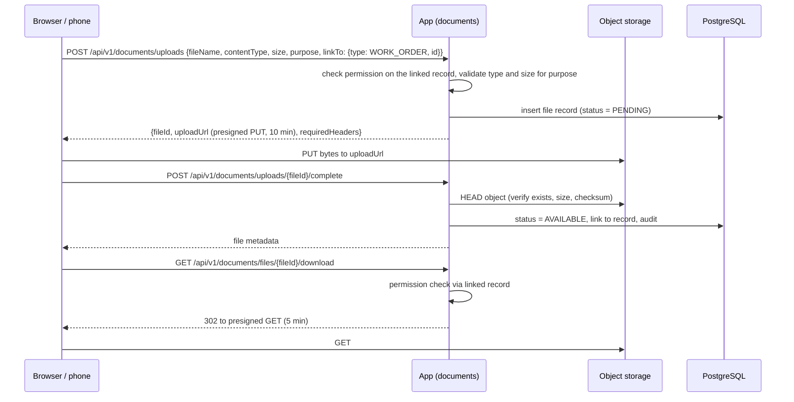

# 10. File Storage Architecture

## What we store

| Kind | Examples | Typical size | Volume |
|------|---------|-------------|--------|
| Site photos | Before/after installation, CCTV camera positions, solar roof, interior progress | 0.5 to 5 MB | Highest volume, from phones |
| Drawings and designs | Interior layouts, architecture drawings, solar single-line diagrams | 1 to 50 MB | Medium |
| Customer documents | KYC, property papers (Real Estate), electricity bills (Solar subsidy), purchase orders | 0.1 to 10 MB | Medium |
| Generated documents | Quotation, order confirmation, invoice, receipt, AMC contract, service report PDFs | 50 to 500 KB | Grows with business |
| Signatures | Customer sign-off on work orders and deliveries | < 100 KB | Per visit |
| Imports / exports | Lead lists, report exports | small | Low |

## Decision: S3-compatible object storage, metadata in PostgreSQL

**Decision.** File bytes go to S3-compatible object storage: **MinIO** when self-hosted (development, and production on own server), or any S3 service if hosted in a cloud. The application talks to it only through the S3 API, behind a `StoragePort` interface in the `documents` module. File metadata and links to business records are stored in PostgreSQL (`documents` schema).

**Why.**
- Large binaries in PostgreSQL bloat the database, slow backups and restores, and waste memory.
- A local filesystem volume would tie files to one server, complicate backups and block running a second app instance.
- The S3 API is a de facto standard: MinIO, AWS S3 and most providers speak it, so moving between self-hosted and cloud is configuration, not code. MinIO is already in the project's agreed storage stack.
- Presigned URLs (below) let browsers and phones upload and download directly, so large files never pass through the Java application or the 1 MB API body limit.

**Rejected.** *Files as `bytea` in PostgreSQL* (see above). *Files on the app server's disk* (single point of failure, not shareable). *A third-party document-management product* (new system, cost, not needed).

## Upload and download flows



- Upload URLs are tied to the exact object key, content type and maximum size.
- `PENDING` uploads that never complete are cleaned up by a nightly job.
- **Download access is decided by the record the file is linked to.** If you can see the work order, you can see its photos. Because business modules depend on `documents` (not the other way round), each business module registers a `FileAccessPolicy` for its link types (from `documents.api`), and `documents` asks that policy whether the current user may see the linked record.
- Sensitive document downloads (KYC, property papers) are audited.

## Object layout

```
bucket: bos-files-{env}          (private, no public access, versioning on)
  {module}/{linkType}/{yyyy}/{mm}/{fileId}            original
  {module}/{linkType}/{yyyy}/{mm}/{fileId}_thumb.jpg  thumbnail for images
bucket: bos-generated-{env}      (private)
  finance/invoice/{yyyy}/{invoiceNumber}_{fileId}.pdf
```

- Object keys use the generated `fileId`, never the user's file name (avoids path tricks and collisions). The original name is stored as metadata and used in the download's `Content-Disposition`.
- Buckets are private; every access goes through presigned URLs.
- Bucket versioning protects against accidental overwrite or deletion.

## Metadata model

`documents.file`: id, bucket, object key, original name, content type, size, checksum (SHA-256), purpose (`SITE_PHOTO`, `DRAWING`, `KYC`, `GENERATED_INVOICE`, ...), status, uploaded by/at, retention class.
`documents.file_link`: file id, linked type and id (`WORK_ORDER`, `PROJECT`, `CUSTOMER`, `INVOICE`, ...), label. One file can be linked to several records (a drawing on both the project and the quotation).

## Validation and safety

- Allowed content types and maximum sizes are configured **per purpose** (photos: JPEG/PNG/HEIC up to 15 MB; drawings: PDF/DWG/images up to 50 MB; KYC: PDF/images up to 10 MB).
- The server verifies the stored object's size and checksum on completion, and checks the file signature (magic bytes) rather than trusting the declared type.
- Files are always served with `Content-Disposition: attachment` unless they are images or PDFs explicitly previewed, and with `X-Content-Type-Options: nosniff`.
- Malware scanning is not part of v1 (staff-only uploads). The `PENDING → AVAILABLE` step is the place to add a scan if customer uploads are ever allowed.

## Images from phones

- The browser downscales photos before upload (long edge 2000 px, JPEG quality ~0.8) to save field staff mobile data. The original resolution is kept only where the purpose requires it (drawings).
- Thumbnails are generated by the application after upload completion using the JDK's built-in imaging, so lists of photos load quickly. *Why no image service:* volumes are modest; this needs no extra technology.
- Photo metadata (capture time, location if permitted) is stored for site evidence.

## Generated documents (PDFs)

- Quotations, invoices, receipts, contracts and service reports are rendered from **versioned templates** configured per vertical in `organization`, then stored in `bos-generated-{env}` and linked to the record.
- **Issued financial documents are rendered once and stored.** Re-downloading an invoice returns the stored file, so what the customer received never changes even if a template changes later.
- The HTML-to-PDF rendering library is not part of the agreed stack yet; it is open decision OD-4 in the [decision log](13-decision-log.md).

## Retention and backup

- Retention classes per purpose: financial documents kept for 8 years by default (configurable; confirm the period with the company's accountant against GST and Companies Act requirements); site photos for the life of warranty/AMC plus a buffer; temporary exports 7 days.
- Object storage is backed up separately from the database on the same schedule ([12](12-deployment-architecture.md)); database backups reference objects by key, and restores are tested together.
