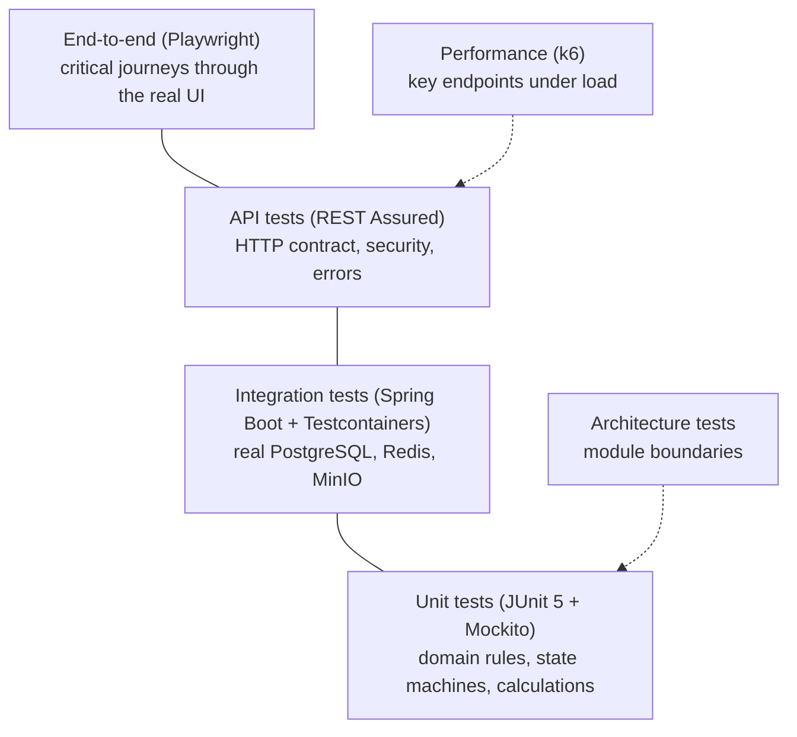

# 11. Testing Architecture

Project rule 6: every meaningful backend business rule has a test. The strategy puts most tests where they are fast and precise (domain rules), and enough integration and end-to-end tests to prove the pieces work together on real infrastructure.

## Test layers

| Layer | Tool | Scope | Runs | Target share |
|-------|------|-------|------|--------------|
| Unit | JUnit 5, Mockito | Domain classes and use-case services with collaborators mocked | Every build | Most tests |
| Integration | Spring Boot test + Testcontainers (PostgreSQL, Redis, MinIO) | Repositories, migrations, transactions, outbox, scheduler jobs, module wiring | Every build | Many |
| API | REST Assured against the app started on a random port with Testcontainers | Endpoint contracts, status codes, Problem Details, permissions and data scopes, idempotency | Every build | One suite per module |
| Architecture | Boundary test (see [02](02-module-boundaries.md) and OD-1) | No illegal cross-module imports, no cycles, no cross-module JPA relations | Every build | One suite |
| End-to-end | Playwright | A handful of critical user journeys through browser, Nginx, app and database | Before merge to main and before release | Few, high value |
| Performance | k6 | Lists, search, dashboards, payment recording at expected and 3× expected load | Before release and on demand | Small scripted set |

## What each layer is responsible for

### Unit tests: business rules
- Every state machine transition: allowed transitions succeed, forbidden ones throw `InvalidStateTransition` (e.g. editing an approved quotation version, paying a void invoice).
- Every calculation: quotation line totals, discounts, GST split (CGST+SGST vs IGST by place of supply), rounding, payment allocation and balances, AMC visit schedule generation, SLA due times.
- Every configurable rule evaluated against its configuration: approval policy matching, numbering formats, custom field validation per vertical.
- Use-case services with mocked repositories and APIs: verify the right audit entry and event are produced.

**Why here.** These rules are the business. Unit tests run in milliseconds, so the full set runs on every change, and a failure points straight at the broken rule.

### Integration tests: the real database
- **Why real PostgreSQL in containers, not an in-memory database:** we rely on PostgreSQL-specific features (schemas, JSONB, `pg_trgm`, partial indexes, `FOR UPDATE SKIP LOCKED`, `CHECK` constraints). An in-memory substitute would pass tests that fail in production.
- Flyway migrations run from scratch in every integration test run; Hibernate `validate` proves entities match the schema.
- Transaction behaviour: a failing step rolls back the business change, its audit entry and its outbox row together.
- Outbox relay: delivers once per listener, retries failures, two relays in parallel never double-deliver.
- Concurrency: two simultaneous payments cannot over-pay an invoice; two simultaneous invoices never share a number.
- Scheduler jobs: idempotent when run twice; lock prevents parallel runs.
- Data-scope queries: a Solar executive cannot load an Interior Design record.

### API tests: the contract and the security
For each endpoint, at minimum:
- Happy path returns the documented shape.
- Validation errors return `422` with field codes.
- Missing permission returns `403`; out-of-scope record returns `404`.
- Version conflict returns `409`.
- Endpoints requiring `Idempotency-Key` return the same result on retry and `409` on key reuse with a different payload.

A permission matrix test iterates the permission catalogue and asserts every non-public endpoint is protected, so a forgotten `@PreAuthorize` fails the build.

### End-to-end tests: the lifecycle works for a user
A small set of journeys that cross modules, run against the full Docker Compose stack:
1. Lead → convert → opportunity → quotation → approval → accept → order.
2. Order → project → work order completed on a phone-sized viewport with photo upload → delivery sign-off.
3. Invoice issued → payment recorded → invoice paid → warranty started.
4. Service ticket under AMC → work order → resolved.
5. Login, token refresh, logout; a restricted role cannot see another vertical.

Each journey checks loading, empty, error and success states where relevant (project rule 7) and runs a basic accessibility check through Playwright's accessibility snapshot.

### Performance tests
k6 scripts for: lead list with filters, customer search, quotation save with 50 lines, dashboard queries, payment recording. Thresholds: p95 < 500 ms, error rate < 1 % at the expected concurrent-user load. Run before each release against staging-sized data.

## Test data

- **Builders per module** (`aQuotation().withLines(3).forVertical(SOLR).build()`) in test sources, so tests read like business statements and are not broken by unrelated new fields.
- Integration and API tests create their own data in each test and do not depend on test order. The database container is reused across tests for speed; tests clean up by truncating module tables between test classes.
- A **seed data set** (verticals, roles, sample customers per vertical) for local development and E2E, loaded by a dedicated profile, never by production migrations.
- Never real customer data in tests or non-production environments.

## Frontend testing

- **Playwright** (in the agreed stack) covers user journeys and the four screen states.
- Type checking (`tsc --noEmit`) and lint run on every build.
- Component- and hook-level unit tests would need a test runner outside the agreed stack; that is open decision OD-2 in the [decision log](13-decision-log.md). Until decided, logic that needs unit testing (money formatting, schema builders for custom fields) is kept in plain functions so it is easy to test once a runner is chosen.

## Quality gates (what must pass before merge)

1. Backend compiles; unit, integration, API and architecture tests pass.
2. Frontend type check, lint and build pass.
3. Flyway migrations apply cleanly on an empty database and on a copy of the previous release's schema.
4. E2E journeys pass for changes touching those journeys (all before a release).
5. No secrets detected in the diff.

How these gates are automated (which CI service) is part of open decision OD-5.

## Decisions

| Id | Decision | Why | Rejected |
|----|----------|-----|----------|
| D-11.1 | Most tests at unit level on the domain | Business rules are the risk; unit tests are fast and precise | Mostly E2E (slow, flaky, vague failures) |
| D-11.2 | Testcontainers with real PostgreSQL / Redis / MinIO | Matches production behaviour exactly | In-memory database (H2) |
| D-11.3 | REST Assured API suite per module with a permission matrix | Security regressions are caught automatically | Manual security testing only |
| D-11.4 | Few, high-value Playwright journeys | Proves the lifecycle end to end without a slow, brittle suite | Recording every screen |
| D-11.5 | k6 thresholds before release | Catches slow queries before users do | No performance testing until problems appear |
