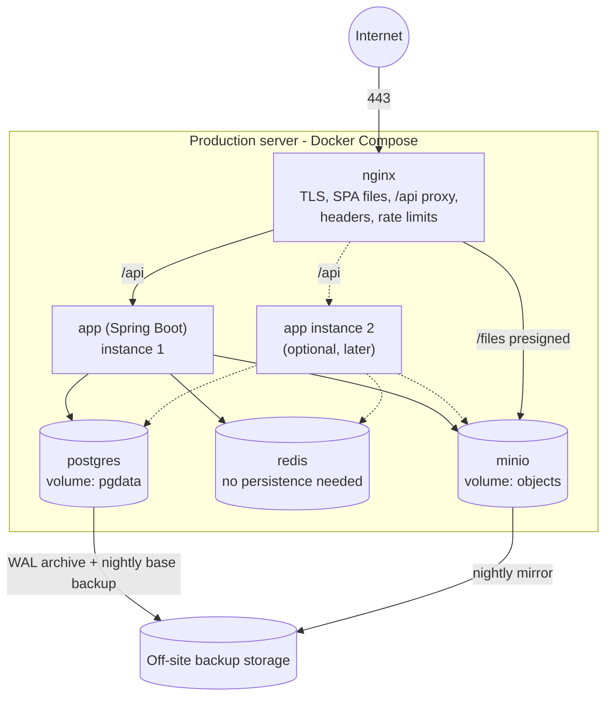

# 12. Deployment Architecture

## Decision: Docker containers orchestrated with Docker Compose, Nginx at the edge

**Decision.** Every runtime piece is a Docker container. One Docker Compose file per environment describes the whole stack. Production starts on a single well-sized Linux server (or VM) and can grow to two application instances behind Nginx without design changes.

**Why.**
- The system serves one company: tens to low hundreds of concurrent users. A single server with Docker Compose handles that comfortably and is something a small team can operate, back up and debug.
- Containers make development, staging and production run the same images, removing "works on my machine" problems.
- The application is stateless (tokens, not sessions; files in object storage; locks and outbox in PostgreSQL), so adding a second instance later is a Compose change, not a redesign.

**Rejected.**
- *Kubernetes:* strong platform, but its operational cost is not justified by one deployable and modest load. The same images can move to it later if the company grows into it.
- *Running the JAR directly on a server without containers:* environment drift and harder upgrades.
- *Managed platform-as-a-service:* possible, but not in the agreed stack and ties the company to a vendor; the container images keep that option open.

## Production topology

| Container | Image | Exposed | Notes |
|-----------|-------|---------|-------|
| `nginx` | Official Nginx + built SPA files + our config | 80 → redirect, 443 | Only public container. |
| `app` | Our backend image (Java 21 runtime, non-root user) | internal only | Health checks via Actuator. |
| `postgres` | Official PostgreSQL (pinned major version) | internal only | Data on a named volume. |
| `redis` | Official Redis | internal only | Cache and throttling only; safe to lose. |
| `minio` | Official MinIO | internal; presigned URLs reach it through Nginx at `/files` | Data on a named volume. If a cloud S3 service is used instead, this container is dropped and only configuration changes. |

**Why MinIO behind Nginx.** Presigned URLs then use the same public host name and TLS certificate as the app, and MinIO is never exposed directly.

## Images

- **Backend:** multi-stage Dockerfile. Stage 1 builds with Maven and runs unit tests; stage 2 is a minimal Java 21 runtime (JRE) image with the Spring Boot layered JAR, running as a non-root user. JVM memory sized from the container limit.
- **Frontend + Nginx:** stage 1 runs the Vite production build; stage 2 is Nginx with the static files and configuration.
- Images are tagged with the git commit and release version; never `latest` in production. The same image moves from staging to production.

## Nginx responsibilities

- TLS termination (certificate from a public CA; automatic renewal), HTTP → HTTPS redirect, HSTS.
- Serve the SPA with long-cache headers for hashed assets and `no-cache` for `index.html`; fall back to `index.html` for client routes.
- Proxy `/api/` to the app (round-robin when two instances exist), passing `X-Request-Id`, `X-Forwarded-For`, `X-Forwarded-Proto`.
- Proxy `/files/` to MinIO for presigned access.
- Security headers ([07](07-security-architecture.md)); gzip/brotli for text assets.
- Rate limits: strict on `/api/v1/auth/` and `/api/v1/webhooks/`, general on `/api/`. Body size limit 1 MB on `/api/`.

**Why Nginx rather than the app for these.** It does TLS, static files, compression and rate limiting efficiently and consistently, and it keeps the Java process off the public edge.

## Environments

| Environment | Purpose | Data | How it runs |
|-------------|---------|------|------------|
| Local | Development | Seed data | `docker compose up` for PostgreSQL, Redis, MinIO; backend and frontend run from the IDE / Vite dev server with hot reload. Vite proxies `/api` to the backend, keeping same-origin behaviour. |
| Test (CI) | Automated tests | Created by tests | Testcontainers; E2E uses the full Compose stack. |
| Staging | Release verification, user acceptance, k6 | Anonymised or synthetic | Same Compose file and images as production, smaller server. |
| Production | Live business | Real | Compose on the production server. |

## Configuration and secrets

- Spring profiles only for technical differences (`local`, `staging`, `prod`). Business configuration lives in the database ([04](04-backend-architecture.md)).
- All environment-specific values and secrets are environment variables read into typed `@ConfigurationProperties`: database URL and credentials, Redis URL, storage endpoint and keys, JWT signing keys, SMTP/SMS/payment provider credentials, public base URL.
- Secrets are stored on the server in a root-only env file (or the host's secret store) referenced by Compose, never committed. `.env.example` lists variable names.
- Each service runs with only the credentials it needs; the app's database user owns the business schemas but has insert/select-only rights on `audit.audit_log`.

## Release process

1. Merge to `main` after quality gates pass ([11](11-testing-architecture.md)).
2. Build and tag images for the commit; deploy to staging; run E2E and k6.
3. Back up production database (snapshot) immediately before deploy.
4. Deploy to production: pull new images, start the new app container. **Flyway migrations run on application start**, before the app reports ready.
5. Nginx sends traffic only to instances whose readiness check passes.
6. Verify health, error rate and key journeys; roll back by redeploying the previous image tag.

**Migrations must be backward-compatible with the previous release** (expand, then contract across two releases: add a column, deploy code that uses it, remove the old one later). *Why:* the previous image must still work against the migrated schema for rollback, and later for zero-downtime deploys with two instances.

## Observability

| Signal | Source | Use |
|--------|--------|-----|
| Health / readiness | Actuator `/actuator/health/liveness`, `/readiness` (internal only) | Docker health checks, Nginx upstream decisions |
| Metrics | Actuator + Micrometer (built into Spring Boot): HTTP latency and errors, JVM, DB pool, cache hit rate, outbox backlog, scheduler job outcomes | Dashboards and alerts |
| Logs | Structured JSON to stdout, collected by Docker's logging driver with rotation | Troubleshooting with request id |
| Audit | `audit.audit_log` | Business investigation, not ops |

Actuator endpoints are not exposed through Nginx. Where metrics and logs are shipped to for dashboards and alerting is open decision OD-6; until then, metrics are scraped on the server and logs are rotated locally.

## Backups and recovery

| What | How | Frequency | Retention |
|------|-----|-----------|-----------|
| PostgreSQL | `pg_basebackup` nightly + continuous WAL archiving (PostgreSQL built-in) to off-site storage | Nightly + continuous | 30 days point-in-time; monthly snapshots 1 year |
| Object storage | MinIO bucket mirror to off-site storage, versioning on | Nightly | 30 days of versions |
| Configuration | Compose files and Nginx config in git; secrets backed up separately and encrypted | On change | — |

- Backups are encrypted at rest.
- **Targets:** recovery point objective ≤ 15 minutes for the database (WAL), ≤ 24 hours for files; recovery time objective ≤ 4 hours.
- **A restore drill runs monthly** to staging: restore database and files, start the app, run smoke tests. An untested backup is not a backup.
- Redis is not backed up: it holds only cache and short-lived counters, which rebuild themselves.

## Scaling path (only when measured need appears)

1. Tune queries and indexes; add caching for hot reference data.
2. Bigger server (vertical scaling).
3. Second app instance behind Nginx (already supported by design).
4. Move PostgreSQL to a managed or dedicated database server with a read replica for analytics.
5. Only then consider extracting a module (likely `notification` or `analytics`) along its existing event and API seams.
