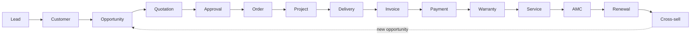

# Pawan Putra Business OS: Architecture

Status: **Proposed** (v0.1, 2026-10-05). No application code exists yet. These documents define how the system will be built; each step of implementation must follow them or update them first.

## What we are building

Pawan Putra Business OS is a service-business operating system for one company that runs seven service verticals:

| # | Vertical | Code |
|---|----------|------|
| 1 | CCTV & Security | `CCTV` |
| 2 | Digital Marketing | `DMKT` |
| 3 | Interior Design | `INTD` |
| 4 | Architecture & Tech | `ARCH` |
| 5 | Real Estate | `REAL` |
| 6 | Solar | `SOLR` |
| 7 | IT Support | `ITSP` |

It is not a generic CRM. It covers the full commercial and operational lifecycle of a service job, from the first enquiry to renewal and cross-sell:

## Documents

| # | Document | Answers |
|---|----------|---------|
| 01 | [System architecture](01-system-architecture.md) | What are the big pieces and how do they fit together? |
| 02 | [Module boundaries](02-module-boundaries.md) | Which module owns which data and behaviour, and how do modules talk? |
| 03 | [Frontend architecture](03-frontend-architecture.md) | How is the React app structured? |
| 04 | [Backend architecture](04-backend-architecture.md) | How is the Spring Boot app structured inside a module? |
| 05 | [Database architecture](05-database-architecture.md) | How is PostgreSQL organised, migrated and kept consistent? |
| 06 | [API architecture](06-api-architecture.md) | What do REST endpoints, errors, paging and idempotency look like? |
| 07 | [Security architecture](07-security-architecture.md) | Authentication, RBAC, data scoping, audit, secrets. |
| 08 | [Event architecture](08-event-architecture.md) | How modules react to each other without coupling. |
| 09 | [Workflow architecture](09-workflow-architecture.md) | Lifecycle state machines, approvals, scheduled work. |
| 10 | [File storage architecture](10-file-storage-architecture.md) | Documents, photos, generated PDFs. |
| 11 | [Testing architecture](11-testing-architecture.md) | What is tested where, with which tool. |
| 12 | [Deployment architecture](12-deployment-architecture.md) | Containers, Nginx, environments, backups, observability. |
| 13 | [Decision log](13-decision-log.md) | Every decision in one table, plus open decisions that need the owner's call. |

## How to read the decisions

Every significant decision is written in the same shape:

> **Decision.** What we will do.
> **Why.** The reason it fits this business and this team.
> **Rejected.** The realistic alternatives and why they lost.

## Guiding principles

1. **One deployable, many modules.** A modular monolith gives us clean boundaries without the operational cost of distributed systems. Boundaries are drawn so a module *could* be extracted later, but nothing is extracted until a measured need appears.
2. **The lifecycle is the spine.** Each lifecycle stage has exactly one owning module. Ownership decides where data lives, who may change it, and who publishes the event when it changes.
3. **Verticals are configuration, not code forks.** The seven verticals share one lifecycle. Differences (pipeline stages, quotation templates, extra fields, approval thresholds, tax defaults) live in configuration tables, so a new vertical needs no new module.
4. **Money and audit are never best-effort.** Financial writes are transactional, idempotent where retried, and every important business operation leaves an audit record.
5. **The server is the authority.** Validation and authorization happen on the server. The frontend repeats validation only for user experience.
6. **Use the named stack and nothing else by default.** Anything outside the agreed stack is listed as an open decision in the [decision log](13-decision-log.md) and is not adopted until approved.

## Glossary

| Term | Meaning |
|------|---------|
| Lead | An unqualified enquiry from any channel (call, walk-in, website, referral, campaign). |
| Customer | A person or organisation we have a relationship with. Has contacts and sites. |
| Site | A physical location belonging to a customer where work happens (install address, office, plot). |
| Opportunity | A qualified chance to sell a defined scope in one vertical. |
| Quotation | A versioned, priced offer for an opportunity. |
| Order | An accepted quotation; the commercial commitment. |
| Project | The delivery plan and execution of an order (tasks, milestones, materials, people). |
| Delivery | Handover of a completed scope or milestone, confirmed by the customer. |
| Warranty | Post-delivery coverage on products and workmanship. |
| Service ticket | A request for service under warranty, AMC or chargeable. |
| AMC | Annual Maintenance Contract: recurring paid coverage with scheduled visits. |
| Renewal | Extension of an AMC or subscription service before it expires. |
| Cross-sell | A new opportunity in another vertical raised for an existing customer. |
